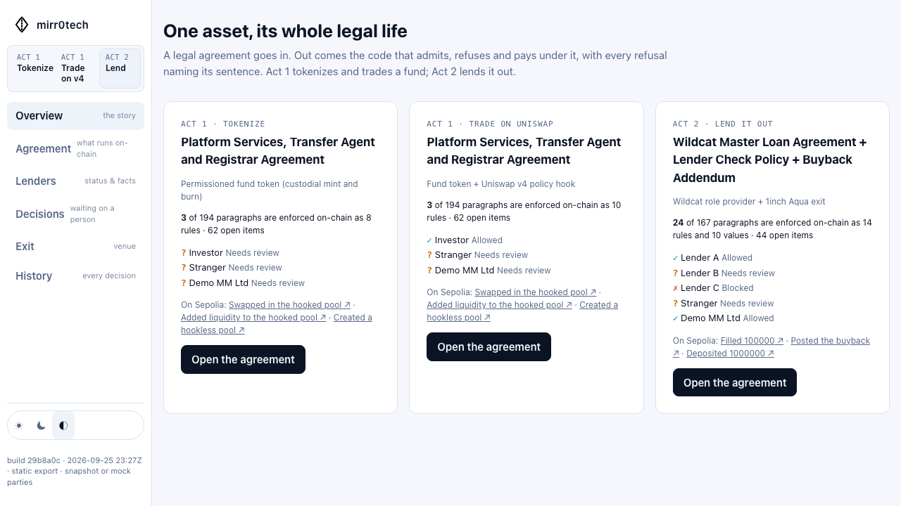
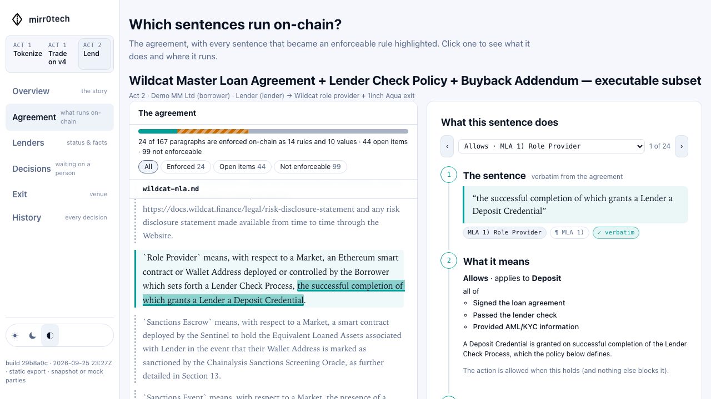

# mirr0tech

**mirr0tech links a tokenized asset's off-chain legal clauses to the on-chain code that executes them.**

A legal document goes in. Out comes a policy grounded in verbatim quotes, hashed to the document, and compiled into each venue the asset passes through: the token's issuance rules, the Uniswap v4 hook it trades through, the Wildcat role provider that admits lenders, the 1inch Aqua strategy that gives a lender an exit. Every on-chain refusal names its clause.

ETHGlobal Tokyo 2026. Prototype, mock USD, not legal advice, no affiliation with Wildcat, 1inch, Uniswap, Securitize or BlackRock.

**Frontend:** [legalmirror.github.io/mirr0tech](https://legalmirror.github.io/mirr0tech/) · **Backend:** [mir-api.peeramid.xyz](https://mir-api.peeramid.xyz/health). GitHub Pages serves the static workbench; the HTTPS API runs separately on Coolify. The frontend uses placeholder World ID login, then connects to a quota-limited demo workspace—no manual operator/viewer keys. Wallet trading uses a separate verified-investor flow.

[](https://legalmirror.github.io/mirr0tech/)

[](https://legalmirror.github.io/mirr0tech/agreement)

## Run it

Use **Node.js 22.13+** and **pnpm 10.29.2**. Both packages share `pnpm-lock.yaml`.

```sh
corepack enable
pnpm install --frozen-lockfile
pnpm run vendor
```

Add `OPENAI_API_KEY` to the server's `.env` for file generation. `OPENAI_MODEL` is optional (default `gpt-5.4-mini`, with reasoning disabled and a compact first-pass analysis). Keys are never sent to the dashboard. The **Demo** flow works without a key and uses a deterministic fixture.

```sh
# Terminal 1: persistent workspace API at http://localhost:3000
pnpm run start

# Terminal 2: dashboard at http://localhost:3100
pnpm --dir dashboard run dev
```

Open **http://localhost:3100**, click **Sign in with World ID** to enter with a placeholder account, then choose **Upload a contract**. Mock login is the default (`WORLD_LOGIN_MODE=mock`); no QR code or World credentials are needed. Login sessions persist in SQLite; see [sandbox login setup and boundaries](docs/WORLD_LOGIN.md).

Once signed in:

- **Demo** generates an AST from the bundled BUIDL document, optionally with the NAV addendum.
- **Upload files** accepts `.txt`, `.md`, `.htm`, and `.html` (2 MB per file, 4 MB request). It saves the original files locally, sends normalized text to OpenAI's Responses API using [Structured Outputs](https://developers.openai.com/api/docs/guides/structured-outputs), validates a version 2.0 legal-document AST with verbatim citations, hierarchy and clause relationships. The completed record is `analyzed`; its graph and JSON download are available independently of the compiler. PDF is not supported.

Files live in `.data/workspace/uploads/<contract-id>/`; records and ASTs live in `.data/workspace/agreements.json`. Set `WORKSPACE_DIR` to change the directory. Reconnecting or restarting preserves the contracts. Failed generation keeps the files and can be retried with **Regenerate**. The local workspace listens only on loopback; remote public demo hosting remains a separate deployment.

### Sepolia deployment

Uploads and AST generation do not require a blockchain. Server startup never connects to an RPC, starts Anvil, or deploys contracts. Sepolia connects lazily when chain status or deployment is requested. For deployment, configure an existing Sepolia stack:

```dotenv
RPC_URL=https://your-sepolia-rpc
EXPECTED_CHAIN_ID=11155111
DEPLOYMENT_PATH=deployments/sepolia.json
DEPLOYER_PRIVATE_KEY=your-testnet-signer-key
# PRIVATE_KEY is also supported; DEPLOYER_PRIVATE_KEY takes precedence.
```

The server checks that the RPC and deployment record target Sepolia. **Deploy** is enabled when a signer is configured and the contract compiles; it requires explicit confirmation. Without a working testnet connection, uploads and generation still work. World ID and investor operations on the full hosted stack are configured separately; see [deployment instructions](deploy/README.md).

### Validate

```sh
pnpm test
pnpm run check                     # all existing policy, venue, stack and cashier chain suites
pnpm --dir dashboard test
pnpm --dir dashboard run typecheck
pnpm --dir dashboard run lint
NEXT_PUBLIC_GATEWAY_URL=https://mir-api.peeramid.xyz pnpm --dir dashboard run build
```

The static build is written to `dashboard/out/`; serve it with `pnpm --dir dashboard start` on port 3100. The browser URL is public configuration, never a place for `API_KEY` or signing keys.

## Workbench and NAV cashier

The workbench follows upload → AST generation → source-linked analysis → optional Sepolia deployment. Start it with `pnpm start` and `pnpm --dir dashboard dev`. Demo generation runs locally; file generation uses `OPENAI_API_KEY`. Source validation and compiler checks do not imply independent model or legal review.

Opt into **NAV cashier addendum** when uploading the bundled fund agreement. The separately authored demo document supplies NAV, subscription/redemption fees and cap; pool fee and tick spacing are deployment settings. The compiler commits typed constructor parameters to the policy, and the hook/router verify them at deployment. See [cashier setup, API and limitations](docs/CASHIER.md).

```sh
pnpm run build:cashier          # optional standalone artifacts/rwa-cashier
pnpm run test:chain:cashier     # real v4 custom-accounting tests on Anvil
```

The cashier is locally tested, **not part of the existing published Sepolia deployment**. It constrains eligible execution through issuance/redemption backed by available mockUSD reserves; it does not guarantee a pinned AMM price or zero LP losses.

## The demo

**Act 1 — tokenize and trade.** The Securitize/BlackRock transfer-agent agreement compiles into a permissioned fund token and a Uniswap v4 hook. Shares mint to custody and release only to an onboarded investor. Anyone may create a pool; one without the hook cannot take the token (`NoPolicyDoor`), and a stranger in the hooked pool is refused with *"Exhibit A — Investor Onboarding"* quoted.

**Act 2 — lend it out.** The Wildcat template Master Loan Agreement, the borrower's Lender Check Policy and a one-clause buyback addendum compile into a Wildcat `IRoleProvider` and a 1inch Aqua strategy. Lender A deposits; Lender B, uncountersigned, goes to review; Lender C, designated by the sanctions oracle, is denied with no override. The borrower ships a standing buyback to Aqua (virtual balance, no capital moves) whose program contains the agreement as an opcode. Lender A fills at the addendum's 0.96; a stranger is refused at quote time; a later designation makes the same strategy unfillable for that wallet and blocks its payment, nothing redeployed.

## How it works

```
document(s) ─► normalize + SHA-256 ─► AST { rules, terms, unresolved }, each with a verbatim quote
            ─► DNF bitmasks per rule ─► equivalence proof vs the JS interpreter (all 3^k assignments)
            ─► policyHash + clause-table hash ─► CompiledPolicy.sol + program templates
```

- **Three-valued facts.** True, false, or not established. Unknown never satisfies a requirement, and an expired attestation makes every fact unknown, so screening is continuous. `contracts/PolicyEval.sol` and `src/policy/evaluate.js` decide identically or the compiler refuses to emit.
- **Observable vs attested.** Sanctions come from the oracle the agreement names, the market's term state from the market; the compliance function attests the rest into `PolicyAttestor` with an expiry. `PolicyOracle` assembles both for every venue.
- **Provenance on every revert.** `LegalClauseViolation(clauseId, policyHash)` / `CounterpartyRefused(subject, clauseId, policyHash)`; the clause table's hash is committed on chain, so the sentence a front end shows cannot be substituted.
- **No generated code.** Extraction emits schema-validated JSON; the compiler emits bitmasks into fixed templates; one audited evaluator serves every policy.

## Venues

| Venue | Contract | The agreement there |
| --- | --- | --- |
| Wildcat V2 | `MirrortechRoleProvider.sol`, Wildcat's real `IRoleProvider` | `getCredential` admits lenders, `mayWithdraw` re-checks at payment, `explain` says why. One `addRoleProvider` call registers it. |
| 1inch Aqua + SwapVM | `swapvm/MirrortechRouter.sol` (`SwapVM` + `LimitOpcodes` + two instructions), `PolicyGuard.sol`, `FixedRateBalances.sol` | The agreement runs inside the maker's program: `PolicyGuard` evaluates maker and taker at every fill and every `quote()`; strategies ship to the unmodified Aqua registry. |
| Uniswap v4 | `MirrorPolicyHook.sol` | Admission on liquidity and swaps, address mined for its permission bits, and a transient handshake that makes the hook the token's only door into Uniswap. |

## Source documents

`test/human_contracts/`: the [Wildcat template MLA](https://docs.wildcat.finance/legal/master-loan-agreement) verbatim with illustrative fields (fictional "Demo MM Ltd"); an illustrative Lender Check Policy and buyback addendum (the MLA delegates admission to the borrower's process, §1); a public Securitize/BlackRock services agreement, interpreted as a subset. Open terms (default remedies, governing law, sanctions disputes) are listed as `unresolved` and block compilation unless `--demo` is passed.

## How we used 1inch Aqua and SwapVM

- **Official contracts.** Aqua unmodified (the canonical registry on Sepolia); `MirrortechRouter` is `SwapVM` + `LimitOpcodes` with two instructions appended, no opcode renumbered (`contracts/swapvm/MirrortechRouter.sol:31-49`).
- **Instructions.** `PolicyGuard._policyGuard` (`PolicyGuard.sol:38-50`) reads `ctx.query.maker/taker` and calls `PolicyOracle.decide`; view-only, so `quote()` refuses before a transaction exists. `FixedRateBalances` (`FixedRateBalances.sol:27-45`) pins the addendum's rate over preloaded Aqua balances.
- **Programs.** `src/onchain/programs.js` derives opcodes from the vendored `LimitOpcodes.sol`, encodes `[opcode][len][args]`, builds hookless Aqua orders and taker traits. Two positions from one addendum: `BuybackFixedPrice` (A1.1) and `BuybackDutchAuction`, the official `DutchAuctionBalanceOut` between rate and curve, floor to the A1.5 ceiling over the window: a tender offer with the agreement as an opcode.
- **Executed.** `test/chain/swapvm.test.js`, `scripts/demo-golden.js`: `ship` → `quote` → `swap` (`pull`/`push`) → refusals → cap, deadline → `dock`; the auction quotes at open, midway and near close, fills, expires.

Feedback: the instruction/router split made an opcode a 40-line job, and `quote()` running the full program statically is what makes pre-trade compliance possible. Friction: `StaticBalances` cannot follow Aqua-preloaded balances (hence `FixedRateBalances`); the full `Opcodes` router plus anything exceeds EIP-170, so `LimitOpcodes`; contracts are not on npm, so `vendor/`; SDK opcode numbering (44) differs from `release/1.1` (46).

## How we used World ID

Sandbox World ID session proofs gate application login. The separate document-verification trust moment is access to issuance, transfer and the cashier. The issuer selects the credential required by the agreement and binds that choice to its policy hash. IDKit requests that credential for the selected wallet; `src/worldid.js` requires a matching, server-validated v4 result before attesting `identityVerified`. A Passport/NFC credential is evidence for a document-based onboarding condition, **not a full KYC/AML, sanctions or accreditation decision**, and those facts remain separate. The workbench shows the exact clause, remaining requirements, cancellation/rejection and a fresh access decision after the receipt. Mock and live proof namespaces are separated. Real World verification still requires registered credentials and a user-completed proof; local demonstrations do not establish live-provider success. [Trust boundaries and integration debrief](docs/WORLD_ID.md).

## Legal document extraction

Uploaded documents use GPT-5.4 mini with reasoning disabled through the OpenAI Responses API. The light analysis selects up to 24 key nodes and 12 relationships; it does not cover every clause. `src/legal/ast.js` defines the document AST: sections and clauses, semantic child nodes, typed cross-references, and explicit open questions. The server validates all quote occurrences against the named source file, computes character offsets, and rejects duplicate IDs, missing link targets and cyclic hierarchy. Noolog extraction has been removed. Offline compiler demos still use explicitly labelled deterministic fixtures; existing saved compiler policies can still be read. A legal-document AST does not by itself authorize deployment. The exact bundled fund and complete credit sources now have explicit MVP compiler mappings; see [live document and Sepolia integration tests](docs/LEGAL_AST.md#executable-mvp-test-mappings).

In **Contract-AST**, select a source clause or graph node to trace its relationships. **Focus selection** shows adjacent clauses and the structural ancestors; clear it for the full graph. **Human Language** highlights the selected quote in the normalized source. **Download AST JSON** exports the full AST (including all source documents, hashes, nodes, relationships and open questions), regardless of the current graph filter. Use **Regenerate** on an existing uploaded contract to replace its old extraction. See [the AST format](docs/LEGAL_AST.md).

## Onchain modules

`src/onchain/` contains the blockchain implementation: deployment and RPC connections, venue operations, deployment-key selection, Solidity compilation, policy and cashier encoding, SwapVM programs, hook-address mining, revert decoding, and audit-event mapping. Application HTTP routes and middleware live in `src/routes.js`; document extraction and policy validation remain outside the chain runtime.

The gateway signs with `DEPLOYER_PRIVATE_KEY`, falling back to `PRIVATE_KEY`. There is no wallet-settings or key-handover API. `GET /v1/stack/events` returns the gateway's audit records, not a complete chain index. Sepolia initialization remains lazy and does not block workspace startup.

## Dashboard and API

`pnpm --dir dashboard run dev` serves http://localhost:3100. Connect the workbench to `pnpm start`; do not put an operator key in `NEXT_PUBLIC_*`. The default view links clause cards to the AST graph and supports actual uploads, analysis, constraints and deployment. The previous overview and classic lender, exit and audit routes remain available. [Dashboard setup](dashboard/README.md) · [API](docs/API.md).

## Deploy

For a standalone Coolify API resource, use [deploy/Dockerfile.api](deploy/Dockerfile.api) and the exact settings in [deploy/README.md](deploy/README.md). Alternatively, `deploy/docker-compose.remote.yml` runs API + dashboard against external Sepolia RPC, with no Anvil service. The local Compose pair is development-only. [Detailed deployment and World configuration](docs/deploy.md). `.github/workflows/pages.yml` publishes GitHub Pages on every push to `main`.

### The flow from a terminal

```sh
# Keep Terminal 1's local dev:stack process above running; use Terminal 3 for these calls.
node scripts/mirr0.js login http://127.0.0.1:3000 local-dev-stack-operator-key-only
node scripts/mirr0.js upload test/human_contracts/ea026411904ex10-9.htm --name BUIDL
# Replace <id> below with the returned agreement id; do not enter the angle brackets literally.
node scripts/mirr0.js show <id> --wait compiled
node scripts/mirr0.js constrain <id> --credential document --actions mint,transfer
node scripts/mirr0.js deploy <id> --wait
node scripts/mirr0.js verify <id> Investor
node scripts/mirr0.js fund <id> Investor 10000
node scripts/mirr0.js mint <id> 10000
node scripts/mirr0.js release <id> Investor 5000
node scripts/mirr0.js pool <id> liquidity Investor
node scripts/mirr0.js pool <id> swap Stranger  # refused with the sentence
```

Every command is one call of the [agreements API](docs/AGREEMENTS_API.md); `GET /docs` is the Swagger UI over all of it.

### Sepolia

Both acts run on Sepolia against the canonical venues; `deployments/sepolia.json` is the record. Use the **Existing Sepolia stack + World Sandbox** launch command above to serve it without redeploying. Policy hashes are the same bytes as the local build.

| Contract | Address |
| --- | --- |
| PolicyAttestor | [`0xB815feD73361792Ff2116f4BAd47BcAA3EEC28ff`](https://sepolia.etherscan.io/address/0xB815feD73361792Ff2116f4BAd47BcAA3EEC28ff) |
| MockSanctionsOracle | [`0x10A9cd9873AA4e9527694Ac06825e21F068A8859`](https://sepolia.etherscan.io/address/0x10A9cd9873AA4e9527694Ac06825e21F068A8859) |
| mUSDC | [`0x68EBB62f76ee7880d7CC71892ec8e3d25565dC67`](https://sepolia.etherscan.io/address/0x68EBB62f76ee7880d7CC71892ec8e3d25565dC67) |
| PolicyOracle (fund) | [`0x56e6d3CcF611a55BA7C40960C6Ab2497A1FD7fD7`](https://sepolia.etherscan.io/address/0x56e6d3CcF611a55BA7C40960C6Ab2497A1FD7fD7) |
| CompiledMirrorToken | [`0x2092e533cb40e61F7C335898258c9F15A487C963`](https://sepolia.etherscan.io/address/0x2092e533cb40e61F7C335898258c9F15A487C963) |
| MirrorPolicyHook | [`0x8218A26F0f3c145D99f673Fc98A362D83c554a80`](https://sepolia.etherscan.io/address/0x8218A26F0f3c145D99f673Fc98A362D83c554a80) |
| MirrorLiquidityRouter | [`0xdCF15E8b14BA3D38D1b024783F656a79d40015eD`](https://sepolia.etherscan.io/address/0xdCF15E8b14BA3D38D1b024783F656a79d40015eD) |
| Uniswap v4 PoolManager (canonical) | [`0xE03A1074c86CFeDd5C142C4F04F1a1536e203543`](https://sepolia.etherscan.io/address/0xE03A1074c86CFeDd5C142C4F04F1a1536e203543) |
| PolicyOracle (credit) | [`0x0d1Bf438432997f0ccd18E80B45510d7064389cD`](https://sepolia.etherscan.io/address/0x0d1Bf438432997f0ccd18E80B45510d7064389cD) |
| MirrortechRoleProvider | [`0x91f3F5c3d452C0F53319387AcdF311Cc4d28a76F`](https://sepolia.etherscan.io/address/0x91f3F5c3d452C0F53319387AcdF311Cc4d28a76F) |
| MockWildcatMarket | [`0x172a0577Be38DE23a91274e149957e8d109daB44`](https://sepolia.etherscan.io/address/0x172a0577Be38DE23a91274e149957e8d109daB44) |
| MirrortechRouter (SwapVM + PolicyGuard) | [`0x71b61324b041c8469602dB051Fea7534024fe0f6`](https://sepolia.etherscan.io/address/0x71b61324b041c8469602dB051Fea7534024fe0f6) |
| 1inch Aqua (canonical) | [`0x1111113ccf1426a8e30e2bff5e005d929bf6a90a`](https://sepolia.etherscan.io/address/0x1111113ccf1426a8e30e2bff5e005d929bf6a90a) |

One agreement through the whole flow on Sepolia, from the CLI (`agr_1b8a5c438bb1`, policy `0xf16e378c…`, constraint: document credential on mint and transfer): PolicyOracle [`0x86d395Ce77889AdfC129647c7FA1f8e94A54b207`](https://sepolia.etherscan.io/address/0x86d395Ce77889AdfC129647c7FA1f8e94A54b207) · CompiledMirrorToken [`0xD29Da36A18A24895dB595d9AEdde43F26a3B91dE`](https://sepolia.etherscan.io/address/0xD29Da36A18A24895dB595d9AEdde43F26a3B91dE) · MirrorPolicyHook [`0x326B840E25bdf27B16da9e4619741c691Ec4CA80`](https://sepolia.etherscan.io/address/0x326B840E25bdf27B16da9e4619741c691Ec4CA80) · pool `0xc0f46419…` on the canonical PoolManager.
[oracle](https://sepolia.etherscan.io/tx/0x570f2dc8e60367a47d8962973c968461685b53f0b503ca9406c379e22eef2a71) · [token](https://sepolia.etherscan.io/tx/0x412d8f2e80e6f696774e6dcfca1c743e30494df713ccc15216ccf797180846f5) · [hook at its mined address](https://sepolia.etherscan.io/tx/0xea934fac812b501abcfa1da0e752203cfaadb3e6d3dde82946d2c2e4ac2a97d8) · [pool initialized](https://sepolia.etherscan.io/tx/0x4b874bbdb139aaeb582fb4c60de1c3897a8ff1e60d8c32cf26d42fb5748e675f) ·
[World ID proof attested](https://sepolia.etherscan.io/tx/0xdf388b7126c413370e3598a7282712278775e6c86f87bc9fbece5c3ce5f092fa) · [shares released](https://sepolia.etherscan.io/tx/0x8cbca868a253007f4dc0ce01890c3aacecca431a7988749e636297c3210f6c6f) · [liquidity through the hook](https://sepolia.etherscan.io/tx/0xa2417ada901ed5fdfefca1d9606f9c80026cb3c1e8332bb5267b1f4f24d1c854) · [swap](https://sepolia.etherscan.io/tx/0x7a8a5f04961153ff52e309e05110fd03996867d10ea192128d8f9ea28717b17e) · the stranger's swap refused with the sentence (`transfer-identity-verified`, no transaction) ·
a signed payment [minted](https://sepolia.etherscan.io/tx/0x515fe4165d9570985482d98f6f4244821dd47e1cf61afb6e6a24736dcab88a4f) and [released 125.50 shares](https://sepolia.etherscan.io/tx/0x42c6907716445d9c4893cae4456f5704cb58366acb3f6f9a7c3afb2790a93099) to the investor; the stranger's payment was held (`subscription-documents`). `deployments/sepolia-agreements.json` is the agreement store (copy it to `generated/agreements-11155111.json` to serve it again) and `deployments/sepolia-agreement-audit.json` its audit.

Golden path on Sepolia, as the audit records it:
[identity verified with a World ID document](https://sepolia.etherscan.io/tx/0xbfa9779df88b5aeb5b7587a5a2ad6368226ebd045757dcd80f0889b57861b748) ·
[shares released to the verified investor](https://sepolia.etherscan.io/tx/0x3baa0a49d05a385f88584ddfd6eb80d12def27226a683811d773171d7704f1cf) ·
[hooked pool created](https://sepolia.etherscan.io/tx/0x168ee3e5a5f60e2c1f4eae9abadcc4a50517af35cf6deec20120a8bdcc3622f3) on the canonical PoolManager ·
[liquidity through the hook](https://sepolia.etherscan.io/tx/0x5c29af26ac59903924890347f0902ee4773d9e8a6f1bc2cb0b304d51a077ad88) ·
[swap](https://sepolia.etherscan.io/tx/0xc315cb93ce6eb203e612a7caf0e55d7d8acbfaef90da73b3fb1870f22d777ad6) ·
[Lender A admitted and deposits](https://sepolia.etherscan.io/tx/0x35f150eb239754991595604735eebdf34cd8bd47ba7597415580b19e12c40c89) ·
[buyback shipped to the canonical Aqua](https://sepolia.etherscan.io/tx/0xf732931467f914badca599ffc884bef8379ccd5e8903ed68b1b24a8ada615c6f) ·
[Lender A fills through SwapVM + PolicyGuard](https://sepolia.etherscan.io/tx/0x5564bf23bfa078e91e1b9178bf78e3e3507db7361abb963e99e7c5444c2f0467).

## Limits

Screening, countersignature, AML/KYC and solvency are attested, not proved; a policy hash is no evidence that anyone was screened correctly. The sanctions oracle and the Wildcat market are mocks with the real interfaces (the real market is mainnet-only). Fact bitmaps are readable per wallet. The fund token is non-rebasing because Uniswap v4 does not support rebasing balances. Not legal advice; no real counterparty.

## Team

⚠️ To be filled in before submission: names and handles.

## Licenses

First-party code is unlicensed (`UNLICENSED`); no license is granted. Earlier releases remain under their original licenses, and previously granted rights are not retroactively withdrawn.

Dependencies, vendored code, and reproduced interfaces retain their original licenses and notices. `vendor/` (git-ignored, fetched by `pnpm run vendor`) holds 1inch SwapVM and Aqua under their source-available Degensoft licenses; the router is a modified redeployment as the hackathon rules permit. `contracts/wildcat/IRoleProvider.sol` reproduces Wildcat's MIT-licensed interface.
