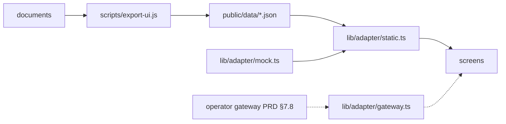

# mirr0tech dashboard

Compliance dashboard for the two compiled profiles. Stack and shell come from the kjuis web app
(Next.js 15 App Router, React 19, TypeScript, plain CSS on the White-Flame tokens, sidebar/drawer
`AppShell`, light/dark/system `ThemeToggle`, prettier, vitest). No Privy, no API keys.

## Run

```bash
npm install                      # repository root, once (the export uses the compiler's deps)
npm --prefix dashboard install
npm --prefix dashboard run dev   # runs `npm run ui:export` first, then http://localhost:3100
npm --prefix dashboard run build # export + static site in dashboard/out/
npm --prefix dashboard test      # vitest: evaluator port, segmentation, export, adapters
```

`npm run ui:export` (repository root) compiles both profiles in-process with `{ demo: true }` and writes
`dashboard/public/data/{index,custodial-rwa,wildcat-credit}.json`. It never touches `generated/`.
The buyback program is decoded only when `vendor/swap-vm` exists (`npm run vendor`).

## Screens

| Route | What |
|---|---|
| `/` Policy | Document with every quoted span highlighted, linked to a six-step pipeline per rule: quote → rule → DNF logic → program bytes → enforcing contract and revert → a three-valued "what would happen" evaluator. Terms and "not compiled" clauses beside it. |
| `/lenders` | Lenders (Act 2) or investors (Act 1): status from the compiled policy, attested facts, sanctions oracle, credential expiry, revoke. |
| `/queue` | Review items (refused only because a fact is unknown): trace, attestation switches, approve / reject. |
| `/exit` | Act 2: the Aqua buyback — terms, decoded instruction list, hash chain, quote/fill as any wallet. Act 1: the Uniswap v4 hook per wallet. |
| `/audit` | Reverse-chronological decisions, each expandable to its replayed trace and clause. |

## Data



- **Static (real):** policy, hashes, rules, terms, unresolved list, DNF terms, per-action program hex and
  word annotations, clause table, buyback program — all recomputed by the compiler at export time.
- **Mock (labelled in the UI):** lenders/investors, their facts, audit events, fills. Kept in memory
  for the session so the queue and the lender list agree.
- **Gateway:** set `NEXT_PUBLIC_GATEWAY_URL` at build time and every screen reads through
  `lib/adapter/gateway.ts` instead (`GET /v1/policy`, `/v1/lenders`, `/v1/audit`, `PATCH …/attestations`,
  `POST …/approve|reject|revoke`). The routes do not exist yet; the shapes are those in `lib/types.ts`.

Decisions in the browser use `lib/evaluate.ts`, a port of `src/policy/evaluate.js` plus the bitmask
`PolicyEval.decide`; tests check both against the original interpreter and every exported DNF. The
clause table is re-hashed in the browser and compared with `clauseTableHash` before a quote is shown
as decoded.
