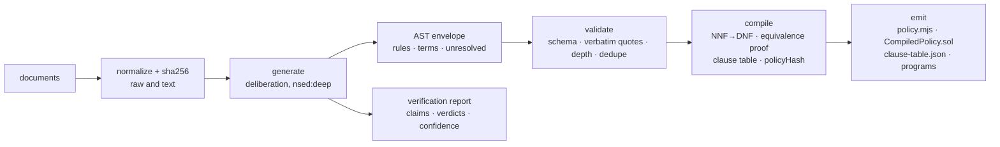
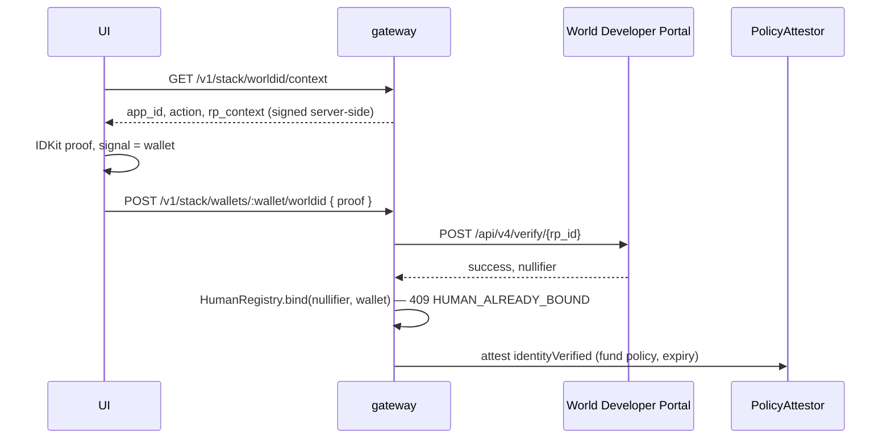

# Architecture

Appendix to [PRD.md](PRD.md). What exists in the repository and the invariants that hold. File map in §9.

## 1. Principle

**Law is source. Code is a build artifact.** The compiler reads a legal document, produces a policy grounded in verbatim quotes, and emits data — bitmasks and template parameters — that fixed, audited contracts execute. Generated Solidity holds data only: `CompiledPolicy` (constants, program bytes) and `CompiledMirrorToken` (constructor arguments).

1. **The model never writes code.** Extraction output is schema-validated JSON. The compiler converts it to bitmasks and program bytes drawn from fixed templates. One evaluator serves every policy.
2. **Unknown is a value.** Facts are true, false or not established. Unknown never satisfies a requirement or clears a prohibition; it propagates through negation. Missing or expired evidence denies.
3. **Anything the compiler cannot quote, it refuses.** Open terms go under `unresolved` and block compilation unless `--demo` is passed.

## 2. Pipeline



### 2.1 Generation (`src/noolog/`)

The extraction is a deliberation, not one model call. `extract.js` posts the document (and a draft AST when one exists) to the OpenAI-compatible `POST /v1/chat/completions` with model `nsed:deep`; the reply's content is the winning proposal and the `x-nsed-session-id` header names the job. It then reads `GET /deliberation/{id}/result`, `/details` and `/references` and returns:

- **envelope** — `{ ast, extraction: { provider: 'noolog', model, responseId, agents }, source: { name, sha256, textSha256, parts? } }`. The compiler's input; `source` is inside the policy hash.
- **verification** (`verify.js`) — `claims[]` with per-agent verdicts `verified | contested | unverified | wrong | unknown`; `contested[]` from the evaluators' disagreements (claim, counter-position, confidence); `confidence { overall, byRef, verified, total, counts }`; winner, rounds, convergence.

`NOOLOG_API_KEY` unset → `mock.js` serves the same routes in-process with a mechanical critic (quote absent → wrong; repeated or short → contested; open item → unverified). `test/noolog.test.js` runs the loop over HTTP. Env and links: [NOOLOG.md](NOOLOG.md); docs MCP `https://noolog.io/mcp` (`.mcp.json`).

### 2.2 AST

`rules[]`: `action ∈ ACTIONS`, `effect ∈ {permit, require, forbid}`, recursive `condition ∈ {fact, all, any, not}`, `source { clause, quote }`, `rationale`. `terms[]`: `{ name, value, unit, source, rationale }`, decimal strings, consumed by templates and config checks, never by the evaluator. `unresolved[]`: `{ clause, description }`. Every quote must be a verbatim substring of the normalized text (`validateAst`).

### 2.3 Decision rule (identical off-chain and on-chain)

```
allowed = (∃ permit = TRUE) ∧ (∀ require = TRUE) ∧ (∀ forbid = FALSE)
```

Three-valued: `require` fails on FALSE or UNKNOWN; `forbid` fails on TRUE or UNKNOWN. The gateway maps this to `approve | review | deny`: deny if any forbid is TRUE, review if not allowed and a relevant fact is UNKNOWN, approve otherwise.

## 3. On-chain evaluation

### 3.1 Representation

Each condition goes NNF → DNF. Kleene logic satisfies De Morgan and distributivity, so the conversion preserves unknown semantics exactly. A rule becomes terms `(pos, neg)`; a fact on both sides is kept (FALSE once known, UNKNOWN until then). Runtime state is two words, `known` and `value`. Bit = index in `FACTS` (`src/policy/schema.js`), committed in `policyHash`.

### 3.2 `PolicyEval.sol`

Pure library. `decide(bytes program, uint256 known, uint256 value) → (bool allowed, uint16 clauseId)`; `program = abi.encode(Rule[])`, `Rule { uint8 effect; uint16 clauseId; uint256[] pos; uint256[] neg; }`. Returns the first failing requirement or prohibition, else the first unmet permission; 0 only for an action with no rules.

### 3.3 `CompiledPolicy.sol` (generated)

Constants `POLICY_HASH`, `CLAUSE_TABLE_HASH`, `FACT_*`, `ACTION_*`, and `program(uint8 action) → bytes`. Every venue imports it: a deployment is bound to one document at compile time.

### 3.4 Equivalence proof

`compilePolicy` replays every rule through the bitmask evaluator and the tree interpreter over all `3^k` assignments of the `k` facts it mentions and throws on the first disagreement. `test/dnf.test.js` repeats it for whole-policy decisions; `test/chain/credit.test.js` on a real EVM via `explain`. For a finite fact space the exhaustive check is the proof.

## 4. Facts

| Kind | Source | Who can be wrong | Examples |
| --- | --- | --- | --- |
| Observable | read on-chain at decision time | oracle / market | `sanctionsClear` (sanctions oracle, MLA §13), `openTermState` |
| Attested | signed into `PolicyAttestor` with expiry | the attestor | `kycApproved`, `mlaCountersigned`, `lenderCheckPassed`, `identityVerified` |
| Derived | computed from attestation state | — | `screeningCurrent` = attestation not expired |

`PolicyOracle` assembles `(known, value)`: the attestor's words with observable bits OR-ed on top. Observable facts never come from the attestor.

### 4.1 `PolicyAttestor.sol`

`attest(subject, policyHash, known, value, issuedAt, expiresAt)` (`ATTESTOR_ROLE`); `attestWithSignature(...)` (EIP-712, relayable); `revokeFacts(subject, policyHash, bits)` (`WATCHER_ROLE`, no reason string); `overrideFacts(subject, policyHash, bits)` (`BORROWER_ROLE`, MLA §13(c)(y), lives and dies with the current attestation window); `factsOf(subject, policyHash)` → zeros once expired. Expiry zeroes `known`, every fact becomes unknown, the policy denies: continuous screening is a property. Worst-case staleness = the attestation window.

### 4.2 `identityVerified` (bit 17) — World ID

Exhibit A of the fund agreement requires KYC, KYB, AML and sanctions checks at onboarding. The fixture compiles that sentence into two `require` rules on the fact `identityVerified`: `mint-identity-verified` and, in `rwa-secondary`, `transfer-identity-verified`. KYC is an identity check, so the credential is **Document** (`issuer_schema_id` 9303, Passport/NFC): the minimum sufficient assurance for an onboarding KYC step. `WORLD_CREDENTIAL` lowers it for an agreement that asks less.



`src/worldid.js`: verifier (mock proofs when `WORLD_RP_ID` is unset), `HumanRegistry` (nullifier → wallet, persisted). `src/onchain/venues.js` `verifyHuman`. Nothing about World ID lives in the contracts; the refusal path reads the sentence through `transfer-identity-verified`. Credential choice and debrief: [WORLD_ID.md](WORLD_ID.md).

### 4.3 Privacy

`factsOf` is public. No identity, no reasons, no free text on-chain. Roadmap: hashed fact commitments or a ZK proof of `decide()`.

## 5. Venues

All venues import `CompiledPolicy` and `PolicyEval`, read `PolicyOracle`, and revert `LegalClauseViolation(uint16 clauseId, bytes32 policyHash)` (`CounterpartyRefused(subject, clauseId, policyHash)` when the other party fails). A front end decodes `clauseId` through `clause-table.json` and verifies the table against `CLAUSE_TABLE_HASH` before rendering the quote.

### 5.1 Wildcat — `MirrortechRoleProvider.sol`

Implements `IRoleProvider` (`contracts/wildcat/IRoleProvider.sol`, vendored verbatim): `isPullProvider`, `getCredential` (evaluates `ACTION_DEPOSIT`, returns the screening timestamp or 0), `validateCredential` (inline signed attestation), `explain(account, action)`, `mayWithdraw`, `mayTransfer`. A borrower registers it with `addRoleProvider(provider, ttl)`. `MockWildcatMarket` stands in for the market and calls the real interface.

### 5.2 1inch — `MirrortechRouter` + `PolicyGuard` + `FixedRateBalances`

[SWAPVM_INTEGRATION.md](SWAPVM_INTEGRATION.md). A guard instruction carrying `policyHash ‖ action` evaluates maker and taker at fill and at `quote()` through `PolicyOracle.decide`; `FixedRateBalances` pins the addendum's price over Aqua balances; a `LimitOpcodes` router dispatches both; `src/onchain/programs.js` fills `BuybackFixedPrice` and `BuybackDutchAuction` from the compiled terms. Strategies ship to the canonical Aqua registry; the router is a modified SwapVM redeploy. Hash chain: `document sha256 ⊂ policyHash ⊂ program bytes ⊂ order.data ⊂ orderHash`.

### 5.3 Uniswap v4 — `MirrorPolicyHook.sol`

`beforeAddLiquidity | beforeRemoveLiquidity | beforeSwap`, all evaluated as `ACTION_TRANSFER`. Subject comes from `hookData` written by the trusted `MirrorLiquidityRouter`. Address mined via `src/onchain/hookAddress.js` (CREATE2 through the deterministic deployer); the constructor rejects an address whose low bits do not match.

**The hook is the token's only door into Uniswap.** `PoolManager` is a singleton, so a token allowlist cannot see which pool a transfer belongs to; the hook can, its address is in the `PoolKey`. Handshake: on success the hook `tstore`s the subject (EIP-1153); `MirrorToken._update`, for any transfer to or from `PoolManager`, calls `hook.consumeApproval()`, which returns the subject and clears it, else reverts `NoPolicyDoor`. A hookless pool initializes; its first settlement reverts at the token. Anyone may create a pool; only hooked pools can hold the token; the issuer publishes one address and never operates a venue. Venue for the fund token (`rwa-secondary`), not for Wildcat positions. Scope claimed: admission plus the handshake; no quota, lockup, fee or LVR claims.

## 6. Component model (`src/onchain/components.js`)

The compiler is a resolver over a library of audited components. Each declares `coversRule`/`coversTerm`, its contracts with their compiler bundle, an optional config check and a clause template. `resolveComponents` links every rule and term to a component or throws; the resolved `{ id, version }` list and the coverage map go inside `policyHash`; `scripts/build-contracts.js` builds exactly the declared contracts. Profiles (`custodial-rwa`, `rwa-secondary`, `wildcat-credit`) are named component sets. **Parameters, never shape**: a clause fills a slot in a versioned template.

| Component | Covers | Emits |
| --- | --- | --- |
| `PolicyEval` | boolean rules | DNF bitmasks |
| `Attestor` | attested facts, expiry, override | deployment |
| `SanctionsOracle` | `sanctionsClear` | address binding |
| `WildcatAdmission` | deposit / withdraw / transfer eligibility | role provider |
| `SwapVMBuyback` | exit terms: price, cap, deadline, curve | program bytes |
| `V4TransferGate` | transfer restriction at a pool | hook |
| `CustodialToken` | mint/burn under custody | ERC-20 constructor args |

## 7. Gateway (Node/Express)

`src/routes.js` defines both Express app factories (`createApp` for the hosted/operator API and `createWorkspaceApp` for the local workspace), all application route groups, authentication middleware, and error handling. Operator routes use `API_KEY` for writes and `VIEWER_KEY` for GET and allowed quotes; World ID login, scoped demo workspaces, and signed payment webhooks retain their own authentication. Errors are `{ error: { code, message } }`. The Noolog provider simulator remains in `src/noolog/mock.js`.

- **Stack API** `/v1/stack/*` (`src/onchain/venues.js`, `src/routes.js`): attest/revoke/override/sanction, World ID context and verify, Act 1 mint/release/pool actions, Act 2 deposit/withdraw and the Aqua buyback (ship, quote, fill, dock), `explain` for any wallet/action, audit with tx hash or decoded refusal (`403 POLICY_REFUSED` with the clause). `GET /v1/stack/events` serves the local gateway audit. [API.md](API.md).
- **Dashboard adapter** (`src/routes.js`): `/v1/policy*`, `/v1/lenders*`, `/v1/audit` served live from the stack.
- **Payment webhook** (`src/payments.js`): `POST /webhooks/payments`, Stripe-signed; a settled USD payment attests `depositConfirmed` for the named wallet and the policy decides the mint (settled into shares, or held with the sentence). Idempotent by event id. Spec: [API.md](API.md#payment-webhook).
- **Deployment signer** (`src/onchain/signer.js`): uses `DEPLOYER_PRIVATE_KEY` or `PRIVATE_KEY`; no wallet settings.
- **Agreements API** (`src/agreements.js`, `src/routes.js`): the core loop upload → generate → verify → compile → deploy. One record per agreement, lifecycle `uploaded → extracting → verified → compiled → deploying → deployed`, `failed` at any step, in memory and at `${DATA_DIR:-generated}/agreements-<chainId>.json`. `POST /v1/agreements` starts a deliberation and returns `extracting`; the background run validates the AST, compiles (hash, clause table, DNF, Solidity, equivalence) and stops at `compiled`; `POST /deploy` (202) compiles the generated Solidity in memory through `src/onchain/solc.js`, deploys `PolicyOracle` + `CompiledMirrorToken` + `MirrorPolicyHook` (salt mined) and initializes the pool on the stack's `PoolManager` (`deployFund`). `GET /v1/status` reports model mode (mock | live), compiler versions and chain. Spec: [AGREEMENTS_API.md](AGREEMENTS_API.md).

`scripts/dev-stack.js` runs anvil + deployment + API in one process; `test/chain/gateway.test.js` drives both acts over HTTP. Wallet separation: deployer/admin · attestor · watcher · borrower-treasury. No wallet holds two roles.

## 8. Deployment

- **Sepolia**: `deployments/sepolia.json` is the record (addresses in the README). Canonical `PoolManager` and canonical Aqua (`0x1111113ccf…`) reused; `MirrortechRouter` is our modified SwapVM redeploy. `pnpm run deploy:sepolia` runs `scripts/deploy-stack.js`.
- **Local**: anvil via `test/chain/anvil.js`; `pnpm run check` runs unit + chain tests for all three profiles; `pnpm run demo:golden` runs both acts.
- **Compilers**: bundles `core` (solc 0.8.37), `uniswap-v4` (0.8.26, `PoolManager` pins it), `swapvm` (0.8.30 via IR) in `src/onchain/solc.js`; `scripts/build-contracts.js` writes `artifacts/<profile>/`, self-contained with `policy.json` and `clause-table.json`; `deployFund` compiles the same bundles at runtime for an uploaded agreement.
- **Hosting**: Coolify compose (`deploy/`, [deploy.md](deploy.md)); static dashboard on GitHub Pages.

## 9. File map

| Path | Role |
| --- | --- |
| `src/policy/document.js` | normalization, sha256, canonical JSON, multi-document bundles |
| `src/policy/schema.js` | `FACTS` (bit order), `ACTIONS`, AST schema, `validateAst` |
| `src/policy/dnf.js`, `evaluate.js` | NNF/DNF, mask evaluation, tree interpreter |
| `src/onchain/policy.js` | ABI-encoded programs, `CompiledPolicy.sol`, clause table hash |
| `src/policy/compile.js` | profiles, config checks, equivalence proof, `policyHash`, artifact emission |
| `src/onchain/components.js` | component registry, profiles, resolver |
| `src/onchain/programs.js` | SwapVM opcode table, instruction encoders, buyback templates, order packing |
| `src/onchain/hookAddress.js` | CREATE2 salt mining for v4 |
| `src/policy/fixture.js`, `mla-fixture.js` | hand-authored draft ASTs (fund agreement; MLA + Lender Check Policy + addendum) |
| `src/noolog/client.js`, `extract.js`, `verify.js`, `mock.js` | deliberation client, generation, verification report, in-process mock |
| `src/worldid.js` | World ID verifier, mock proofs, `HumanRegistry` |
| `src/agreements.js`, `src/routes.js` | agreement store + lifecycle + AST graph; `/v1/agreements*`, `/v1/status` |
| `src/payments.js` | payment rail webhook: signature check, `depositConfirmed`, mint under policy or hold |
| `src/onchain/signer.js` | Server-side deployment key selection: `DEPLOYER_PRIVATE_KEY` or `PRIVATE_KEY` |
| `src/onchain/solc.js` | compiler bundles, one compile path for the build script and the runtime deploy |
| `src/onchain/venues.js`, `src/routes.js` | stack service, `/v1/stack/*`, dashboard adapter |
| `src/routes.js`, `src/server.js` | Express app, auth, error envelope |
| `src/onchain/deploy.js`, `scripts/deploy-stack.js` | one-call deployment of both acts against any RPC; `deployFund` for an uploaded agreement |
| `src/onchain/refusal.js` | revert → clause decoder (unwraps Uniswap's `WrappedError`) |
| `contracts/PolicyEval.sol`, `PolicyAttestor.sol`, `PolicyOracle.sol` | evaluator, facts, fact assembly + decision |
| `contracts/MirrorToken.sol`, generated `CompiledMirrorToken.sol` | fund token with the venue-hook door |
| `contracts/MirrorPolicyHook.sol`, `contracts/test/MirrorLiquidityRouter.sol` | Uniswap v4 hook and trusted router |
| `contracts/MirrortechRoleProvider.sol`, `wildcat/IRoleProvider.sol` | Wildcat venue |
| `contracts/swapvm/PolicyGuard.sol`, `FixedRateBalances.sol`, `MirrortechRouter.sol` | 1inch venue |
| `contracts/MockSanctionsOracle.sol`, `MockWildcatMarket.sol`, `test/MockERC20.sol` | stand-ins |
| `scripts/compile.js`, `build-contracts.js`, `export-ui.js` | build; dashboard export (`ui/policy-<profile>.json`) |
| `scripts/dev-stack.js`, `demo-golden.js`, `seed-stack.js` | local runner, terminal demo, seed |
| `test/*.test.js`, `test/chain/*.test.js` | unit (equivalence, components, noolog, worldid, agreements) and anvil tests (`agreements-deploy`: an upload deploys its own token, hook and pool) |
| `test/human_contracts/` | source documents |
| `dashboard/` | Next.js UI; target workbench in PRD §10 |

## 10. Invariants

1. Same `policyHash` ⇒ same decision, off-chain and on-chain, for every `(action, known, value)`. Compile-time proof plus chain test.
2. `policyHash = sha256(canonical({ version, demo, profile, source, ast, config, components, coverage, factOrder, actionOrder, clauseTableHash }))`. Any change to the document text, a quote, a rule, a term, the config or the fact order changes the hash; a changed hash is a new policy and needs a redeploy. Deployed contracts keep enforcing the document as signed.
3. Unknown never approves. Tested for negation and contradiction.
4. Expiry never grants. `factsOf` returns zeros after `expiresAt`.
5. A revert's `clauseId` indexes a table whose hash is on-chain; the UI verifies before rendering.
6. Observable facts are read, not attested.
7. No generated logic: bitmasks and template parameters; generated Solidity carries constants and constructor arguments only.
8. No reasons, identity or free text on-chain. World ID leaves a fact bit on chain and a nullifier binding off chain.
9. The fund token cannot reach `PoolManager` except through a pool that ran the hook in the same transaction.
10. An agreement record's `policyHash` is the hash of the export it serves; `deployed` means those bytes are on chain.
