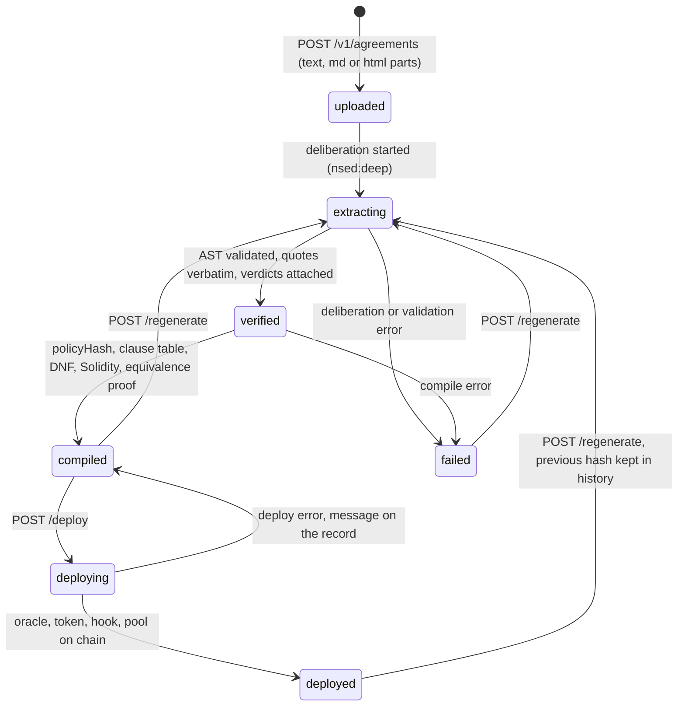
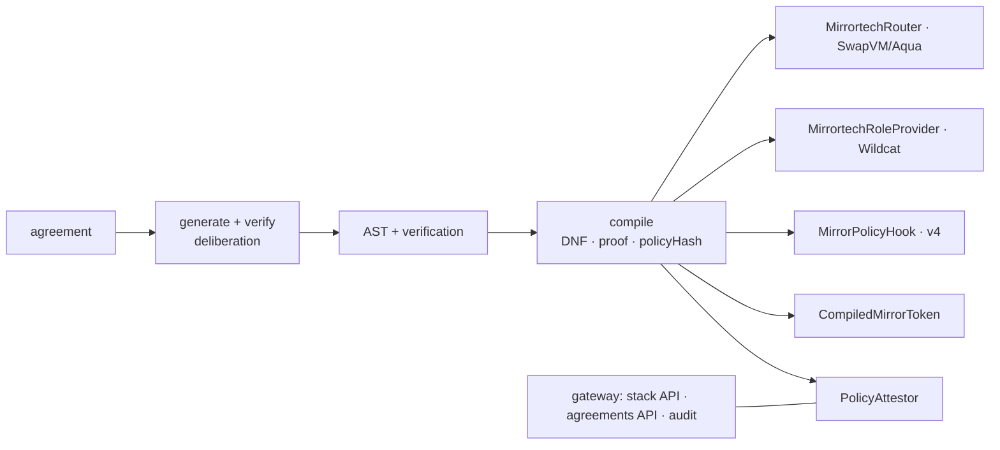

# mirr0tech — Product Requirements (ETHGlobal Tokyo 2026)

| | |
| --- | --- |
| **Status** | **v3**. Supersedes v2 and v1 (`PRD_v1.pdf`). Decisions locked unless marked ⚠️. Both acts green on anvil, deployed and seeded on Sepolia; dashboard public on GitHub Pages; World ID document credential live as a policy fact; extraction generated and verified by a deliberation. In progress: Agreements API (branch `feat/agreements-api`), then the workbench UI (§10) |
| **Owner** | Lam (PM) |
| **Team** | Lam (PM, pitch, legal content, QA) · Eng A (contracts + chain) · Eng B (backend, integrations) · UI shared |
| **Deadline** | **Sun 27 Sep 2026, 09:00 JST** submission. Code freeze **Sun 03:00 JST** |
| **Repo** | `LegalMirror/mirr0tech`, branch `main` |
| **Chain** | **Sepolia, one chain.** Canonical Uniswap v4 `PoolManager` and canonical 1inch Aqua registry reused; our router is a modified SwapVM redeploy, which the 1inch rules allow. MultiBaas registers every contract |
| **Tracks** | One prize per company. **1inch — Build an Aqua App** · **Curvegrid — Best RWA Tokenization Project** (⚠️ or Digital Asset Dashboard, Lam picks) · **World** — document credential as the KYC fact · Uniswap — hook claim ready, P1. Table in §12 |
| **Appendices** | [ARCHITECTURE.md](ARCHITECTURE.md) · [AGREEMENTS_API.md](AGREEMENTS_API.md) · [SWAPVM_INTEGRATION.md](SWAPVM_INTEGRATION.md) · [MLA_CLAUSE_MAP.md](MLA_CLAUSE_MAP.md) · [WORLD_ID.md](WORLD_ID.md) · [NOOLOG.md](NOOLOG.md) · [DEMO_SCRIPT.md](DEMO_SCRIPT.md) |

> Terms: **MLA** = Wildcat's template Master Loan Agreement. **Term Sheet** = Exhibit A of the MLA. **Lender Check Policy** = the borrower's own admission process document (the MLA delegates to it). **AST** = the structured policy generated from a document. **Credential** = Wildcat's on-chain permission to deposit. **Role Provider** = the contract Wildcat calls to grant it. **Agreement record** = one uploaded document and its lifecycle in the Agreements API.

## 1. One-sentence pitch

mirr0tech links a tokenized asset's off-chain legal clauses to the on-chain code that executes them: the fund's transfer-agent agreement becomes the token's issuance rules and the Uniswap v4 hook it trades through; the Wildcat MLA under which it is lent becomes the role provider that admits lenders and the 1inch Aqua strategy that gives them an exit. One compiler, one asset, every decision traceable to a verbatim clause.

## 2. Problem

A tokenized asset's documents govern who may hold it, where it may trade and on what terms it may be lent. Almost none of that reaches the chain; the translation lives in a spreadsheet, so the chain enforces an allowlist, not the agreement.

- **Issue and trade.** A fund's transfer-agent agreement (Securitize/BlackRock type) names the onboarding a holder must clear. On chain: a custodial ledger and a hand-kept allowlist. A pool would breach the agreement, so counsel says no; billions in primary issuance, negligible secondary volume.
- **Lend it out.** Market makers borrow through **Wildcat**; each market's MLA delegates lender admission to an on-chain **Role Provider** running the borrower's **Lender Check Process** (§1). Today: manual checks, point-in-time screening, payouts without a fresh check, no compliant exit (§12 permits transfer only to a credentialed wallet; no venue enforces that, so none exists).
- **Common root.** Nothing proves which clause justified which action. A list cannot tell *not permitted* from *not yet checked*, so it over-admits or over-blocks silently.

Who feels it: the issuer's transfer agent and counsel; the borrower's compliance team; lenders who want out; treasury (cheaper capital when lenders have an exit).

## 3. Goals, non-goals, success criteria

**Goals — one asset, two phases, one loop**

- G0. **Core loop** (§4): upload any agreement, generate its policy by deliberation, verify every claim against the text, compile, deploy a policy-managed token + pool. Backend: Agreements API. UI: workbench (§10).
- G1. Compile the Securitize/BlackRock agreement into the permissioned fund token; issue to onboarded investors. Done.
- G2. Same agreement → Uniswap v4 hook, the token's **only door into Uniswap**: anyone may create a pool; only hooked pools can hold the token; a stranger is refused quoting "Exhibit A — Investor Onboarding". Done.
- G3. Compile the real Wildcat MLA + Term Sheet + Lender Check Policy + buyback addendum with the proof that on-chain and off-chain decisions agree. Done.
- G4. Admit, deny and re-screen lenders on Sepolia through Wildcat's real `IRoleProvider`; review for unknowns; no override of prohibitions. Done.
- G5. Lender exit on 1inch Aqua: shipped buyback, admitted fill, stranger refused at quote time. Done.
- G6. Payment-time eligibility via `mayWithdraw`. Done.
- G7. World ID document credential as the KYC fact `identityVerified` for issuance and the pool. Done.
- G8. UI: policy ↔ clause with verification, lenders, exits, audit; target workbench in §10.

**Non-goals**: a real Wildcat V2 market on Sepolia (mock market calls the real provider interface); real KYC/screening vendors or funds (mock USDC); interest/delinquency state machine; PDF/OCR; investor self-service auth (operator API only); legal correctness guarantees.

**Success criteria at freeze**

- [ ] Golden path (§5) runs on Sepolia from the UI in < 5 min, both acts.
- [ ] Act 1: one investor verified, minted and pooled; one stranger refused at the pool with the clause; one reused proof refused `HUMAN_ALREADY_BOUND`.
- [ ] Act 2: one denied onboarding, one held payout, one refused exit fill, each with the quote; `quote()` reverts for an unadmitted taker before any tx.
- [ ] An agreement uploaded through `POST /v1/agreements` reaches `compiled` with a Verified badge, and `deploy` puts its pool on chain.
- [ ] §12 items ticked; public repo, README, video, live URL.

## 4. Core loop: upload → generate → verify → compile → deploy

The product is this loop; the two acts are two agreements run through it. Backend spec: [AGREEMENTS_API.md](AGREEMENTS_API.md).

| Step | What happens | Evidence in the UI |
| --- | --- | --- |
| Upload | document normalized; `sha256` of raw bytes and text | source name, hashes |
| Generate | a deliberation (extractor + critic agents) proposes rules, terms and open items, each with a verbatim quote; the hand-authored fixture seeds it as a draft when its quotes hold in the document (the mock needs that draft; the live model reads any document) | model mode (mock/live), job id |
| Verify | every claim gets per-agent verdicts `verified / contested / unverified / wrong`; contested items carry the evaluator's counter-position; the AST is validated against the text | Verified badge with confidence; contested markers on clause cards |
| Compile | DNF per rule, exhaustive equivalence proof, clause table hash, `policyHash` over source + AST + config, Solidity generated | policy hash, coverage, equivalence checks |
| Deploy | background job: Solidity compiled at runtime; `PolicyOracle` + `CompiledMirrorToken` + `MirrorPolicyHook` (salt mined) deployed; pool initialized on the stack's `PoolManager` | addresses, five txs, pool id, explorer links, refusal demo |

A record is immutable per hash. `regenerate` starts a new deliberation and keeps the old hash in `history`. Any text change in the AST changes the hash and requires a redeploy. Auth: the gateway bearer (`API_KEY` writes, `VIEWER_KEY` reads).

## 5. Demo script (golden path)

Narration and timing in [DEMO_SCRIPT.md](DEMO_SCRIPT.md). One asset, start to finish.

**Act 1 — tokenize and trade (Securitize agreement)**

| # | View | What happens | Shown |
| --- | --- | --- | --- |
| 1 | Human Language | Upload the fund agreement. Generating → Verified: clause cards with quote, rule, verdict; confidence badge; contested items | Noolog |
| 2 | Contract-AST | agreement → actions → rules → facts/terms; `identityVerified` under mint and transfer | — |
| 3 | Deploy | Compile + deploy: oracle, token, hook (mined address), pool on the canonical `PoolManager`; hash on chain | Curvegrid, Uniswap |
| 4 | Investors | Investor verifies with World ID (Document credential) → `identityVerified` attested → onboarding facts → mint. Stranger reusing the proof → `HUMAN_ALREADY_BOUND` | World |
| 5 | Deploy · refusal demo | Hookless pool: `initialize` ok, first `addLiquidity` reverts at the token (`NoPolicyDoor`). Hooked pool: investor adds liquidity and swaps; stranger refused, "Exhibit A — Investor Onboarding" rendered | Uniswap |

**Act 2 — lend it out (Wildcat MLA)**

| # | View | What happens | Shown |
| --- | --- | --- | --- |
| 6 | Human Language | Switch agreement: MLA + Term Sheet + Lender Check Policy + addendum. Same loop, different paper; the MLA's repeated sentences come back contested | Noolog |
| 7 | Lenders | A: facts attested → auto-approved, `getCredential(A)` returns a timestamp, deposit succeeds. B: `mlaCountersigned` unknown → review. C: oracle-designated → denied, no override | — |
| 8 | Exit | Borrower ships the buyback to Aqua (0.96, cap, deadline); no capital moves; program disassembled: `Deadline · PolicyGuard(policyHash) · FixedRateBalances · LimitSwap`; hash chain shown. Tender-offer variant: `DutchAuctionBalanceOut` from A1.5 | 1inch |
| 9 | Exit | A quotes and fills (`pull`/`push`). Stranger quotes → `LegalClauseViolation`, MLA §12(b) rendered | 1inch |
| 10 | Lenders → Exit | Officer designates A. A's next quote reverts; `mayWithdraw(A)` blocked citing §13. Nothing redeployed | 1inch |
| 11 | Audit | Timeline of every decision with clause and tx (MultiBaas events on Sepolia). Close: change one word → new `policyHash`; the deployed hook and strategy keep enforcing the document as signed | Curvegrid |

## 6. Users and key stories

| As a… | I want to… | So that… | Pri |
| --- | --- | --- | --- |
| Compliance officer | upload an agreement and see each rule next to the clause it came from, with who verified it | I can check the machine's reading before anything goes live | P0 |
| Compliance officer | see contested readings flagged, not hidden | I review the edge cases, not the whole document | P0 |
| Issuer | deploy the token and its pool from the verified policy in one action | the venue enforces the prospectus without an allowlist | P0 |
| Investor | prove identity once with a document credential | I am onboarded without handing over my data twice | P0 |
| Compliance officer | have clean lenders auto-approved and only unknowns queued | my time goes to edge cases | P0 |
| Compliance officer | never be able to approve a sanctioned wallet | a mis-click cannot become a breach | P0 |
| Lender | sell my position to an admitted buyer before the withdrawal cycle | I have an exit with a price instead of a queue | P0 |
| Borrower treasury | stand a buyback bid without parking capital | lenders accept a lower rate because they can leave | P0 |
| Treasury ops | have withdrawals screened at payment time | we never pay a newly sanctioned wallet | P0 |
| Auditor | see why any wallet was allowed, paid, refused or blocked | regulators get answers in minutes | P0 |

## 7. Solution

Detail in [ARCHITECTURE.md](ARCHITECTURE.md).

One compiler, one evaluator (`PolicyEval.sol`), several venues. The policy never varies logic; it varies two `uint256` words and template parameters. Kept from the original MVP: normalization and provenance, verbatim-quote validation, strict schema, fail-closed evaluator, idempotency and audit in the service layer.

## 8. Functional requirements

P0 = in the demo · P1 = if P0 green · P2 = stretch.

### 8.1 Policy and legal content (Lam + Eng B)

- **P0** Source documents in `test/human_contracts/`: Securitize/BlackRock services agreement (public, interpreted as a subset); Wildcat template MLA verbatim with an illustrative Exhibit A ("Demo MM Ltd", mUSDC, transferability (ii)); one-page Lender Check Policy (screening cadence 30 days); one-clause buyback addendum (price, cap, expiry, ceiling, window). No real counterparty names.
- **P0** Generation by deliberation with the hand-authored fixture as the draft; the verification report ships in every export. **P1** Live extraction diff against the fixture reading.
- **P0** Fact set; unknown fails closed. Observable facts are read on-chain; attested facts are signed into `PolicyAttestor` with expiry.

| Fact | Source | Type | Clause | Used by |
| --- | --- | --- | --- | --- |
| `identityVerified` (bit 17) | World ID Document credential, verified by the gateway | attested | Exhibit A — Investor Onboarding | mint, transfer (fund) |
| `kycApproved`, `amlApproved`, `subscriptionAccepted`, … | operator | attested | fund agreement, Exhibit A | mint, burn, transfer (fund) |
| `sanctionsClear` | sanctions oracle (mock on Sepolia) | observable | Exhibit A; MLA §13(b) | all actions |
| `mlaCountersigned` | operator | attested | §20, Exhibit A signatures | deposit, transfer |
| `lenderCheckPassed` | operator per Lender Check Policy | attested | §1 Lender Check Process | deposit, transfer |
| `amlKycProvided`, `notInsolvent` | operator | attested | §3(j), §3(e) | deposit |
| `screeningCurrent` | attestation not expired | derived | Lender Check Policy | deposit, withdraw, transfer |
| `openTermState` | market state | observable | §1, §2(f) | withdraw |
| `borrowerOverride` | borrower role, logged, window-bound | attested | §13(c)(y) | withdraw |

- **P0** Everything the documents leave undecided goes in `unresolved` and blocks compilation without `--demo`. MLA mapping: [MLA_CLAUSE_MAP.md](MLA_CLAUSE_MAP.md).
- **P0** Terms: `buybackPrice`, `buybackCap`, `buybackDeadline`, `buybackCeiling`, `buybackWindowHours` from the addendum.

### 8.2 Decision engine (Eng B)

| Outcome | Condition | Effect |
| --- | --- | --- |
| approve | every `require` true, a `permit` true, no `forbid` true, facts known | attest → credential |
| review | no `forbid` true, some fact unknown | queue; officer sets attestations; re-evaluate |
| deny | any `forbid` true | hard stop; no officer override; only the borrower's §13(c)(y) path |

`explain(wallet, action)` on chain returns the same `(allowed, clauseId)`; the UI shows both.

### 8.3 Contracts (Eng A) — built

`PolicyEval`, `PolicyAttestor` (no reason strings; `overrideFacts` under `BORROWER_ROLE`), `PolicyOracle`, `MirrorToken` + generated `CompiledMirrorToken`, `MirrorPolicyHook` (mined address; transient handshake; `NoPolicyDoor` at the token), `MirrortechRoleProvider` (real `IRoleProvider`), `MockSanctionsOracle`, `MockWildcatMarket` (labeled mock), `MockERC20`. Scope claimed for the hook: admission on `beforeAddLiquidity` / `beforeRemoveLiquidity` / `beforeSwap` plus the handshake; no quota, lockup, fee or LVR claims. **P1** counsel EIP-712 signature over `policyHash`; merkleized clause table.

### 8.4 SwapVM venue (Eng A) — built

[SWAPVM_INTEGRATION.md](SWAPVM_INTEGRATION.md). `PolicyGuard` (view-only, runs in `quote()`), `FixedRateBalances`, `MirrortechRouter is SwapVM, LimitOpcodes`; templates `BuybackFixedPrice` and `BuybackDutchAuction`; Aqua mode (`ship` / `dock`, virtual balance, no capital moves) against the canonical registry. **P1** `PoolPriceAdjuster` (bid follows the v4 TWAP, capped at NAV); signature mode; maker-hook variant.

### 8.5 Integrations (Eng B)

- **World — built.** Document credential (`issuer_schema_id` 9303) verified at the Developer Portal, `rp_context` signed server-side, nullifier bound to one wallet, fact attested. Mock proofs without `WORLD_RP_ID`. §9 and [WORLD_ID.md](WORLD_ID.md).
- **Noolog — built.** Generation + verification (§4). In-process mock when `NOOLOG_API_KEY` is unset. [NOOLOG.md](NOOLOG.md).
- **Curvegrid — built.** MultiBaas registers every contract under a policy-hash version; `GET /v1/stack/events` serves indexed events on Sepolia. Fallback per call: ethers direct; README records what worked.
- **P2** ENSv2 status subnames; screening vendor adapter; payout agent.

### 8.6 API (Eng B)

- **Stack API** `/v1/stack/*` — built; [API.md](API.md).
- **Agreements API** `/v1/status`, `/v1/agreements*` — in progress; [AGREEMENTS_API.md](AGREEMENTS_API.md).
- Conventions: decimal-string amounts, `Idempotency-Key` on operations, bearer auth, error envelope `{ error: { code, message } }`.

## 9. Trust moments

1. **Reading the document.** The Verified badge is the deliberation's confidence, not a model's self-report. Contested claims are shown on the clause card with the evaluator's counter-position. A quote that is not in the text is dropped before compilation.
2. **Identity at onboarding.** Exhibit A requires KYC, KYB, AML and sanctions checks. KYC is an identity check: a proof of human says a person exists, a selfie says the person is live and unique, neither says who. A government document does. The credential is **Document (Passport/NFC, 9303)**: one credential, verified once, no Orb, the minimum that satisfies a KYC step. `WORLD_CREDENTIAL` lowers it (`proof_of_human`, `selfie`) for an agreement that asks less. The nullifier binds one human to one wallet; the proof's signal must be that wallet. Refusals: `HUMAN_ALREADY_BOUND`, `INVALID_PROOF`; a closed widget leaves the wallet in review with the sentence that still blocks it.
3. **Refusal.** Every revert carries `clauseId` and `policyHash`; the UI verifies the clause table against the on-chain hash before rendering the sentence.
4. **Deploy.** The hash on chain covers source, AST and config. Change one word and the deployed contracts keep enforcing the document as signed; the new reading is a new deployment.

## 10. Target UI (workbench)

IDE-style workbench, built after the Agreements API. No vendor branding in labels.

- **Left sidebar "Contracts"**: agreements from `GET /v1/agreements`, each with a status pill: Uploaded · Generating · Verified · Compiled · Deploying · Deployed · Failed. "Upload" opens a name + file/paste dialog → `POST /v1/agreements` (`{ name, text, filename }`, or several `documents`).
- **Main pane**: breadcrumb `<agreement> › <view>`; a **Verified** badge with the confidence (`verification.confidence.overall`; counts on hover); toolbar buttons **Re-generate** (`POST /regenerate`, disabled while a job runs) and **Deploy** (`POST /deploy`, enabled only in Compiled; the pill turns Deploying until the record says `deployed`).
- **View switcher**:
  - **Human Language** — the document as clause cards: `§n` badge, the verbatim quote, the rule it compiles to (action · effect · condition), a verification glyph per claim (verified ✓ · contested ⚠ · unverified ○ · wrong ✕), a contested marker with the evaluator's position; unresolved items listed with their anchor.
  - **Contract-AST** — graph from `GET /:id/ast`: agreement → actions → rules → facts, plus terms and unresolved items; node status follows the verdicts (verified / contested / unverified); selecting a node highlights its clause card.
  - **Deploy** — chain, addresses (oracle, token, hook, pool id), txs with explorer links; refusal demo: pick a wallet, run mint / add liquidity / swap, see the clause on refusal.
- **Footer status strip** from `GET /v1/status`: three lights — **Model** (`model.mode` mock / live, url), **Compiler** (`compiler.solidity` versions), **Chain** (`chain.chainId`, pool manager; grey when `null`).
- States: Generating shows a progress row (job id, rounds); Failed shows the record's `error` and a Re-generate call to action; Deployed puts Re-generate behind a confirm (new hash → new deployment).
- Existing screens (Lenders, Queue, Exit, Audit) remain as views of the credit agreement.

## 11. Non-functional and security

- **Fail closed**: unknown fact, RPC uncertainty, expired attestation → no approval, payout or fill.
- **No model-written logic**: extraction is schema-validated data; generated Solidity holds constants and constructor arguments only.
- **Proven equivalence** before emit; repeated on a real EVM.
- **Privacy**: facts, never reasons or identity, on chain; no reason strings in events; fact bitmaps readable per wallet (stated; roadmap hashed facts / ZK). World ID leaves a fact bit and an off-chain nullifier binding.
- **Verification is backend-only**: an IDKit result is never authorization until `/v4/verify` accepts it and the signal matches the wallet.
- **Override**: none for officers; only the MLA's §13(c)(y) borrower path, separate role, window-bound, logged.
- **Bounded staleness**: the attestation window (Lender Check Policy, 30 days).
- **Secrets** in `.env`; the public dashboard carries `VIEWER_KEY` only. Separate wallets: deployer/admin, attestor, watcher, borrower-treasury. Testnet keys only.
- **Disclaimers**: prototype, testnet, not legal advice, no affiliation with Wildcat, 1inch, Uniswap, Securitize or BlackRock. Aqua/SwapVM are source-available (Degensoft license).

## 12. Prize alignment

| Partner | What we built | Evidence | Status |
| --- | --- | --- | --- |
| World (IDKit) | Document credential → `identityVerified`, gating mint and the pool; server-side `rp_context`, `/v4/verify`, nullifier bound to one wallet; success and refusal paths; debrief | `src/worldid.js`, `dashboard/app/_components/HumanCheck.tsx`, `test/worldid.test.js`, [WORLD_ID.md](WORLD_ID.md) | P0 submit |
| Uniswap v4 | Hook as the token's only door: mined address, transient handshake, `NoPolicyDoor`; permissionless pools under a permissioned agreement | `contracts/MirrorPolicyHook.sol`, `src/policy/hookAddress.js`, `test/chain/hook.test.js`, `FEEDBACK.md` | P1; feedback form pending |
| 1inch (Aqua + SwapVM) | `PolicyGuard` + `FixedRateBalances` opcodes in a `LimitOpcodes` router; buyback and tender-offer strategies shipped to the canonical Aqua; refusal at `quote()` | `contracts/swapvm/`, `test/chain/swapvm.test.js`, README "How we used 1inch" | P0 submit |
| Curvegrid (MultiBaas) | contracts registered under policy-hash versions; events behind the Audit view | `src/multibaas.js`, `test/multibaas.test.js` | P0 submit (RWA Tokenization ⚠️ or Dashboard) |
| Securitize / BlackRock | the public transfer-agent agreement is Act 1's source; Exhibit A compiles to issuance, the hook and the identity fact | `test/human_contracts/`, `src/policy/fixture.js` | source document, not a track |
| Wildcat | real `IRoleProvider`; MLA §1/§12/§13 compiled; mock market calls the real interface | `contracts/MirrortechRoleProvider.sol`, [MLA_CLAUSE_MAP.md](MLA_CLAUSE_MAP.md) | source document + interface, not a track |
| Noolog | generation by deliberation; per-claim verdicts and confidence in every export; docs MCP wired in `.mcp.json` | `src/noolog/`, `test/noolog.test.js`, README "How we used Noolog" | built |

ETHGlobal general: commits across the weekend, video, description, screenshots, live URL. Intercepta dropped (x402 agent payments are a different product).

## 13. Plan

| When (JST) | Milestone | Exit check |
| --- | --- | --- |
| done | Both acts on anvil and Sepolia; stack API; dashboard public; MultiBaas sync; World ID fact; deliberation generation + verification | `npm run check` green; README Sepolia table |
| Sat | Agreements API on `feat/agreements-api`: store, lifecycle, `/v1/status`, `/ast`, `regenerate`, `deploy` with runtime solc | `test/agreements*.test.js`, `test/chain/agreements-deploy.test.js` green; the walkthrough in [AGREEMENTS_API.md](AGREEMENTS_API.md) runs |
| Sat night | Workbench UI (§10) over the Agreements API; footer lights; refusal demo | Lam runs §5 from the UI twice |
| Sun 03:00 | Code freeze; bug fixes only | tag `v0.3-freeze` |
| Sun 03:00–07:00 | Video, README team section, sponsor forms, screenshots | video uploaded |
| Sun 08:00 | Submit (1h buffer) | confirmed |

Small PRs to `main`; commit every couple of hours (the 1inch rules disqualify a single final-day commit); any P0 slipping > 2h → tell Lam and cut per §14.

## 14. Scope cut order

1. Contract-AST view (fall back to the clause cards) · footer lights
2. Runtime `deploy` from the workbench (fall back to `npm run deploy:stack` and a read-only Deploy view)
3. P1 SwapVM items, merkleized clause table, counsel signature
4. **Never cut**: source-quoted rules, verification report, equivalence proof, real `IRoleProvider`, Aqua `ship` + `PolicyGuard` quote-time refusal, World ID document credential path, Sepolia deploy, Curvegrid README items

## 15. Risks

| Risk | Likelihood | Mitigation |
| --- | --- | --- |
| Live deliberation slow or unavailable at demo time | Med | the mock serves the same routes; the fixture reading is the draft; the status strip shows the mode honestly |
| Runtime solc in the API too slow or too large for the container | Med | bundles already built by `scripts/build-contracts.js`; cache artifacts per policy hash; fall back to prebuilt artifacts |
| Judges read "official Aqua contracts" as canonical only | Low | canonical registry reused on Sepolia; the router is a modified SwapVM redeploy, allowed verbatim |
| World app not migrated to v4 or no `rp_id` at demo time | Med | mock proofs run every path; `APP_NOT_MIGRATED` surfaced as its own code |
| Privacy: fact bitmaps readable per wallet | Certain | no reasons or identity on chain; stated; roadmap ZK |
| Scope for 3 people | High | §14; loop first, polish last |

## 16. Decisions log

| Topic | Decision | Why |
| --- | --- | --- |
| Extraction | generated by a deliberation, verified per claim; the fixture is the draft, not the output | a policy should arrive with who checked it and how sure they were; a single model call cannot say |
| World ID credential | Document (9303) as the KYC fact, not proof of human | Exhibit A asks for KYC; a proof of human proves a person, not who; a document is the minimum that does |
| World ID surface | a fact of the policy (`identityVerified`), attested by the gateway | nothing vendor-specific in contracts; every venue reads it like any other fact |
| Product core | Agreements API loop, one record per agreement | the two acts become two runs of one loop; any agreement can be uploaded |
| UI | IDE-style workbench, three views, footer health lights | the loop and its trust moments visible on one screen; no vendor labels |
| Primary credit venue | real `IRoleProvider` + SwapVM buyback | Wildcat exposes the exact socket; SwapVM makes the policy an instruction |
| Uniswap v4 | hook as the token's only door, fund token only | a token gate cannot see pools; the hook can |
| Sanctions authority | oracle per MLA §13 (mock on Sepolia) | observable, not attested |
| Override | MLA §13(c)(y) borrower override only, separate role, window-bound | the MLA already defines the appeal path |
| Chain | Sepolia, one chain; canonical Aqua and PoolManager | the rules allow the modified SwapVM redeploy; everything else canonical |
| Privacy | no reason strings in events | revocation reasons on chain are a defamation risk |
| Intercepta | dropped | x402 agent payments are a separate product |

## 17. Open questions

1. ⚠️ Curvegrid: RWA Tokenization or Digital Asset Dashboard? (Lam)
2. ⚠️ Uniswap feedback form submission. (Lam)
3. ⚠️ Team names and handles in the README. (all)
4. Public live gateway (Coolify creds) vs. static site with Sepolia links. (Eng A)
5. Demo video length limit. (Lam)

## 18. References

- Wildcat: [Template MLA](https://docs.wildcat.finance/legal/master-loan-agreement) · [Hooks](https://docs.wildcat.finance/technical-overview/security-developer-dives/hooks) · [`IRoleProvider.sol`](https://github.com/wildcat-finance/v2-protocol/blob/main/src/access/IRoleProvider.sol)
- 1inch: [Aqua](https://github.com/1inch/aqua) · [SwapVM](https://github.com/1inch/swap-vm) · [OpenZeppelin audit](https://www.openzeppelin.com/news/1inch-aqua-and-swapvm-mvp-v1.0-audit)
- World: [IDKit](https://docs.world.org/world-id/idkit/integrate) · [credentials](https://docs.world.org/world-id/idkit/credentials) · [Passport/NFC](https://docs.world.org/world-id/credentials/9303)
- Noolog: [what it is](https://noolog.io/docs/noolog/latest/explanation/what-is-noolog.html) · docs MCP `https://noolog.io/mcp` · [gateway API](https://api.peeramid.xyz/swagger-ui/)
- Curvegrid: [MultiBaas docs](https://docs.curvegrid.com/multibaas/) · ETHGlobal Tokyo 2026 [prizes](https://ethglobal.com/events/tokyo2026/prizes)
