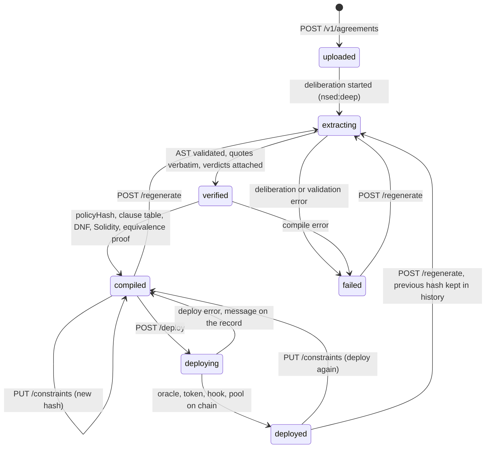
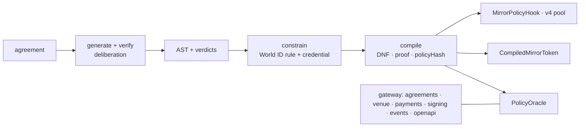

# mirr0tech — Product Requirements (ETHGlobal Tokyo 2026)

| | |
| --- | --- |
| **Status** | **v4** (2026-09-26). Supersedes v3. One flow: login → upload → constrain with World ID → deploy → trade through the hook. Green on anvil end to end (`test/chain/flow.test.js`); the base stack is on Sepolia; the CLI (`scripts/mirr0.js`) is the front end; the workbench UI (§10) is deferred. Decisions locked unless marked ⚠️ |
| **Owner / team** | Lam (PM, pitch, legal content, QA) · Eng A (contracts + chain) · Eng B (backend, integrations) · UI shared |
| **Deadline** | **Sun 27 Sep 2026, 09:00 JST** submission. Code freeze **Sun 03:00 JST** |
| **Repo** | `LegalMirror/mirr0tech`, branch `main` |
| **Chain** | **Sepolia, one chain.** Canonical Uniswap v4 `PoolManager` reused. Gateway audit records track its operations |
| **Tracks** | One prize per company. **World** — document credential as the KYC fact · **Uniswap** — v4 hook · Table in §12 |
| **Appendices** | [ARCHITECTURE.md](ARCHITECTURE.md) · [AGREEMENTS_API.md](AGREEMENTS_API.md) · [API.md](API.md) · [WORLD_ID.md](WORLD_ID.md) · [NOOLOG.md](NOOLOG.md) · [DEMO_SCRIPT.md](DEMO_SCRIPT.md) |

> Terms: **Agreement record** = one uploaded document and its lifecycle in the Agreements API. **AST** = the policy generated from it: rules, terms, unresolved items, each quoting the text verbatim. **Constraint** = a rule the issuer adds after generation; today, the World ID identity constraint. **Fact** = a three-valued input to a rule (true / false / unknown). **Policy hash** = hash over source + AST + config.

## 1. One-sentence pitch

mirr0tech compiles a tokenized asset's legal agreement into the token's issuance rules and the Uniswap v4 hook it trades through: upload the document, add the World ID constraint the agreement asks for, deploy, and every decision on chain names the sentence that made it.

## 2. Problem

A fund's transfer-agent agreement (Securitize/BlackRock type) says who may hold the token and what onboarding they must clear. On chain that becomes a hand-kept allowlist. A list cannot tell *not permitted* from *not yet checked*; nothing proves which clause justified which action; a pool would breach the agreement, so counsel says no. Billions in primary issuance, negligible secondary volume. Who feels it: the issuer's transfer agent and counsel; the investor who proves identity twice; the auditor who asks why a wallet was refused.

## 3. Goals, non-goals, success criteria

**Goals — one agreement, one issuer, one token**

- G1. Upload any agreement; a deliberation generates its AST with a verdict per claim and a confidence; the policy compiles with proof. Done.
- G2. The issuer puts a World ID constraint on the agreement; the rule and the credential are in the hash. Done.
- G3. Deploy from the record: oracle, token, hook, pool on the canonical `PoolManager`. Done.
- G4. The hook is the token's only door: a verified investor trades; a stranger is refused with the sentence. Done.
- G5. Platform capabilities around the flow: payments in, deployment signing, gateway auditing, an OpenAPI contract (§8.5). Done.

**Non-goals**: real KYC/screening vendors or funds (mock USD); PDF/OCR; investor self-service auth (operator API only); legal correctness guarantees; a rebasing token (v4 has no rebasing balances).

**Success criteria at freeze**

- [ ] §5 runs on Sepolia from the CLI in < 5 min.
- [ ] One investor verified, minted and pooled; one stranger refused at the pool with the sentence; one reused proof refused `HUMAN_ALREADY_BOUND`; one wrong credential refused `WRONG_CREDENTIAL`; one payment minted through the webhook, one held with the sentence.
- [ ] §12 items ticked; public repo, README, video, live URL.

## 4. The flow: login → upload → constrain → deploy → prove

Backend spec: [AGREEMENTS_API.md](AGREEMENTS_API.md). Every CLI command is one call of it.



| Step | What happens | Evidence |
| --- | --- | --- |
| 1 Login | `mirr0 login <url> <key>`. Bearer `API_KEY` writes; `VIEWER_KEY` reads | `GET /v1/status`: model, compiler, chain |
| 2 Upload → AST | `POST /v1/agreements`. A Noolog deliberation (extractor + critic) proposes rules, terms and open items, each quoting the document verbatim; every claim gets a verdict `verified / contested / unverified / wrong`, the report a confidence; the AST is validated against the text; the policy compiles: `policyHash` over source + AST + config, clause table, DNF programs, generated Solidity, exhaustive equivalence proof. `GET /ast` is the tree agreement → actions → rules → facts/terms | status, confidence, contested count, hash |
| 3 Constrain | `PUT /constraints { identity: { credential, actions, quote, clause } }` adds `require identityVerified` per action, quoting the sentence that asks for it, and records the credential in the config. Both inside the hash → `compiled` again, `deployment: null` | new hash; `GET /constraints` |
| 4 Deploy | `POST /deploy`: Solidity compiled at runtime; `PolicyOracle` + `CompiledMirrorToken` + `MirrorPolicyHook` (CREATE2 salt mined) deployed; pool initialized on the shared `PoolManager` with the hook. Venue routes `/v1/agreements/:id/stack/*` open (facts, World ID proof, mint/release, liquidity, swap, audit) | addresses, five txs, pool id |
| 5 Prove | facts alone do not admit: the refusal names `transfer-identity-verified` and the sentence; `mirr0 verify` (World ID proof) admits; the investor adds liquidity and swaps through the hook; a stranger's swap is `POLICY_REFUSED` with the sentence | audit: `worldid.verify ok`, `rwa.pool.swap refused` |

A record is immutable per hash. `regenerate` starts a new deliberation and keeps the old hash in `history`. Any change to the AST or config changes the hash and requires a redeploy. With the mock model (`NOOLOG_API_KEY` unset) the demo agreements are read from the hand-authored draft; the live model reads any document.

## 5. Demo script (golden path)

Narration and timing in [DEMO_SCRIPT.md](DEMO_SCRIPT.md). `test/chain/flow.test.js` runs exactly this on anvil.

```sh
mirr0 login http://127.0.0.1:3000 local-dev-stack-operator-key-only
mirr0 upload test/human_contracts/ea026411904ex10-9.htm --name BUIDL   # → agr_…  extracting
mirr0 show agr_… --wait compiled && mirr0 ast agr_…                    # Verified, confidence, the tree
mirr0 constrain agr_… --credential document --actions mint,transfer    # the trust decision, in the hash
mirr0 deploy agr_… --wait                                              # oracle, token, hook, pool
mirr0 facts agr_… Investor kycApproved=true amlApproved=true sanctionsClear=true
mirr0 explain agr_… Investor                                           # refused — transfer-identity-verified
mirr0 verify agr_… Investor                                            # World ID proof (mock without --proof)
mirr0 fund agr_… Investor 10000 && mirr0 mint agr_… 10000 && mirr0 release agr_… Investor 5000
mirr0 pool agr_… liquidity Investor && mirr0 pool agr_… swap Investor  # through the hook
mirr0 pool agr_… swap Stranger && mirr0 audit agr_…                    # POLICY_REFUSED, with the sentence
```

| # | Shown | Partner |
| --- | --- | --- |
| 1 | Generating → Verified: rules with quote and verdict, confidence, contested items. Contract-AST after `constrain`: `identityVerified` under mint and transfer, the hash changed | Noolog |
| 2 | Deploy: oracle, token, hook (mined address), pool on the canonical `PoolManager`; hash on chain | Uniswap |
| 3 | Investor verifies with the Document credential → `identityVerified` → mint. Stranger reusing the proof → `HUMAN_ALREADY_BOUND`; a proof of human → `WRONG_CREDENTIAL` | World |
| 4 | Investor adds liquidity and swaps; stranger refused, "Exhibit A — Investor Onboarding" rendered. Hookless pool (`pool create --hookless`): `initialize` ok, first `addLiquidity` reverts at the token (`NoPolicyDoor`) | Uniswap |
| 5 | Audit: every decision with clause and tx; gateway audit events on Sepolia. Close: change one word → new hash; the deployed hook keeps enforcing the document as signed | Audit |

## 6. Users and key stories

| As a… | I want to… | So that… | Pri |
| --- | --- | --- | --- |
| Compliance officer | upload an agreement and see each rule next to the clause it came from, with who verified it and what is contested | I review the edge cases, not the whole document | P0 |
| Issuer | choose the credential the agreement's KYC sentence needs, and have that choice in the hash | the deployed token carries my trust decision | P0 |
| Issuer | deploy the token and its pool from the verified policy in one action | the venue enforces the agreement without an allowlist | P0 |
| Investor | prove identity once with a document credential | I am onboarded without handing over my data twice | P0 |
| Investor | pay in USD and receive shares, or be told which sentence held them | funding and onboarding are one step | P1 |
| Issuer | configure a server-side deployment key | deploy without wallet settings | P1 |
| Auditor | see why any wallet was allowed, refused or held | regulators get answers in minutes | P0 |

## 7. Solution

Detail in [ARCHITECTURE.md](ARCHITECTURE.md).



One compiler, one evaluator (`PolicyEval.sol`), one venue per agreement. The policy never varies logic; it varies two `uint256` words and template parameters. Kept, out of the flow: the credit venue (Wildcat `IRoleProvider`, 1inch Aqua/SwapVM router; `contracts/MirrortechRoleProvider.sol`, `contracts/swapvm/`, [SWAPVM_INTEGRATION.md](SWAPVM_INTEGRATION.md), [MLA_CLAUSE_MAP.md](MLA_CLAUSE_MAP.md)) still builds, tests and sits on Sepolia; it is not the product story.

## 8. Functional requirements

P0 = in the demo · P1 = if P0 green · P2 = stretch.

### 8.1 Policy and legal content

- **P0** Source document in `test/human_contracts/`: the public Securitize/BlackRock services agreement (`ea026411904ex10-9.htm`), interpreted as a subset. No real counterparty names.
- **P0** Generation by deliberation; the verification report ships in every export. Unknown fails closed. Observable facts are read on chain; attested facts are signed into `PolicyAttestor` with expiry. What the document leaves undecided goes in `unresolved`; the demo profile compiles past it, the report shows it.

| Fact | Source | Type | Clause | Used by |
| --- | --- | --- | --- | --- |
| `identityVerified` | the World ID credential named by the constraint, verified by the gateway | attested | the sentence the constraint quotes (Exhibit A — Investor Onboarding) | the actions the constraint names |
| `kycApproved`, `amlApproved`, `subscriptionAccepted` | operator | attested | Exhibit A | mint, transfer |
| `depositConfirmed` | payment webhook, or operator | attested | subscription and payment | mint |
| `sanctionsClear` | sanctions oracle (mock on Sepolia) | observable | Exhibit A | all actions |

### 8.2 Decision engine

Allow when every `require` is true, a `permit` is true, no `forbid` is true and every fact is known; refuse otherwise: `403 POLICY_REFUSED` off chain, `LegalClauseViolation(clauseId, policyHash)` on chain, the audit names the sentence. `explain(wallet, action)` off chain and on chain return the same `(allowed, clauseId)`.

### 8.3 Contracts — built

`PolicyEval`, `PolicyAttestor` (no reason strings), `PolicyOracle`, `MirrorToken` + generated `CompiledMirrorToken`, `MirrorPolicyHook` (mined address; transient handshake; `NoPolicyDoor` at the token), `MockSanctionsOracle`, `MockERC20`. Hook scope claimed: admission on `beforeAddLiquidity` / `beforeRemoveLiquidity` / `beforeSwap` plus the handshake; no quota, lockup, fee or LVR claims. **P1** counsel EIP-712 signature over `policyHash`; merkleized clause table.

### 8.4 World ID constraint — built

`PUT /v1/agreements/:id/constraints { identity: { credential: document | proof_of_human | selfie, actions: [mint, transfer, burn], quote, clause } }`; `identity: null` lifts it; `400 QUOTE_NOT_FOUND` when the quote is not verbatim in the document. Minimum sufficient credential: **Document** (Passport/NFC, `issuer_schema_id` 9303) for KYC/AML onboarding; `proof_of_human` where only a person is needed; `selfie` for liveness. The verifier for that agreement accepts only that credential (`WRONG_CREDENTIAL`), refuses a proof whose signal is another wallet (`INVALID_PROOF`), binds the nullifier to one wallet (`HUMAN_ALREADY_BOUND`) and attests the fact with expiry. Mock proofs without `WORLD_RP_ID`. [WORLD_ID.md](WORLD_ID.md).

### 8.5 Platform capabilities around the flow — built

Routes: Agreements API `/v1/status`, `/v1/agreements*`, `/v1/agreements/:id/stack/*` ([AGREEMENTS_API.md](AGREEMENTS_API.md)); Stack API `/v1/stack/*` over the base deployment ([API.md](API.md)); the four below. Conventions: decimal-string amounts, `Idempotency-Key` on operations, bearer auth except the webhook and the contract, error envelope `{ error: { code, message } }`.

| Capability | Endpoint and behaviour | Where |
| --- | --- | --- |
| Payments in | `POST /webhooks/payments`. Stripe signature scheme (`Stripe-Signature`, HMAC over `t.body`, 5-min tolerance), no bearer. A settled USD event with `metadata.wallet` attests `depositConfirmed` for that wallet; the policy decides the mint: shares released, or **held** with the sentence. Idempotent by event id (`replay: true`). Always 2xx once verified | [API.md](API.md#payment-webhook), `src/payments.js` |
| Deployment key | Server-side `DEPLOYER_PRIVATE_KEY`, falling back to `PRIVATE_KEY` | `src/onchain/signer.js`, `test/deployment-signer.test.js` |
| Audit | `GET /v1/stack/events` returns gateway audit entries; it is not a complete chain index | `src/onchain/venues.js` |
| API contract | `GET /openapi.json` (OpenAPI 3.1) + `GET /docs` (Swagger UI); webhooks under a **Webhooks** tag with the signature security scheme. Both open, no bearer | `src/openapi.js`, `test/openapi.test.js` |

## 9. Trust moments

1. **Reading the document.** The Verified badge is the deliberation's confidence, not a model's self-report. Contested claims are shown with the evaluator's counter-position. A quote that is not in the text is dropped before compilation.
2. **Choosing the credential.** Exhibit A requires KYC, KYB, AML and sanctions checks. KYC is an identity check: a proof of human says a person exists, a selfie says the person is live, neither says who. A government document does. The issuer chooses per agreement; the choice is a rule quoting the sentence plus the credential in the config, both in the hash. The verifier accepts only that credential; one human, one wallet.
3. **Refusal.** Every revert carries `clauseId` and `policyHash`; a front end verifies the clause table against the on-chain hash before rendering the sentence.
4. **Deploy and custody.** The hash on chain covers source, AST and config. Change one word, or the constraint, and the deployed contracts keep enforcing the document as signed; the new reading is a new deployment. The server signs deployments with `DEPLOYER_PRIVATE_KEY` or `PRIVATE_KEY`.

## 10. Target UI (workbench)

Deferred; the CLI is the current front end. IDE-style, one flow, no vendor branding in labels.

- **Left sidebar "Contracts"**: agreements from `GET /v1/agreements`, each with a status pill: Uploaded · Generating · Verified · Compiled · Deployed · Failed (Deploying while `POST /deploy` runs). "Upload" opens a name + file/paste dialog → `POST /v1/agreements`. Generating shows a progress row; Failed shows `error` and Re-generate; Deployed puts Re-generate and the constraint behind a confirm (new hash → new deployment).
- **Main pane**: breadcrumb `<agreement> › <view>`; a **Verified** badge with the confidence; toolbar **Add World ID constraint** (`PUT /constraints`: credential, actions, the sentence picked from the document), **Re-generate** (`POST /regenerate`, disabled while a job runs), **Deploy** (`POST /deploy`, enabled only in Compiled).
- **Views**: **Human Language** — clause cards: `§n`, the verbatim quote, the rule (action · effect · condition), a verification glyph per claim, contested marker, unresolved items. **Contract-AST** — graph from `GET /:id/ast`; node status follows the verdicts; the constraint's rules highlighted. **Deploy** — chain, addresses, txs with explorer links; refusal demo: pick a wallet, run mint / liquidity / swap, see the sentence.
- **Footer status strip** from `GET /v1/status`: **Model** (`model.mode`), **Compiler** (`compiler.solidity`), **Chain** (`chain.chainId`; grey when `null`).

## 11. Non-functional and security

- **Fail closed**: unknown fact, RPC uncertainty, expired attestation → no approval, mint or fill. **No model-written logic**: extraction is schema-validated data; generated Solidity holds constants and constructor arguments only; equivalence proven before emit, repeated on a real EVM.
- **Privacy**: facts, never reasons or identity, on chain; no reason strings in events; fact bitmaps readable per wallet (stated; roadmap hashed facts / ZK). World ID leaves a fact bit and an off-chain nullifier binding.
- **Verification is backend-only**: an IDKit result is never authorization until `/v4/verify` accepts it, the credential matches the agreement and the signal matches the wallet. **Webhook**: the signature is the credential; a policy refusal is 2xx, so the rail never retries a decision.
- **Secrets** in `.env`; the public dashboard carries `VIEWER_KEY` only. Deployment key stays in the server environment (§8.5). Separate wallets: deployer/admin, attestor, watcher. Testnet keys only.
- **Disclaimers**: prototype, testnet, not legal advice, no affiliation with Uniswap, World, Stripe, Securitize or BlackRock.

## 12. Prize alignment

| Partner | What we built | Evidence | Status |
| --- | --- | --- | --- |
| World (IDKit) | Document credential as the KYC fact, chosen per agreement by the issuer and locked in the hash; server-side `rp_context`, `/v4/verify`, credential check, nullifier bound to one wallet; success and refusal paths; debrief | `src/worldid.js`, `src/agreements.js` (`constrain`), `test/worldid.test.js`, `test/chain/flow.test.js`, [WORLD_ID.md](WORLD_ID.md) | P0 submit |
| Uniswap v4 | Hook as the token's only door: mined address, transient handshake, `NoPolicyDoor`; a pool per agreement on the canonical `PoolManager`; permissionless pools under a permissioned agreement | `contracts/MirrorPolicyHook.sol`, `src/onchain/hookAddress.js`, `src/onchain/deploy.js`, `test/chain/hook.test.js`, `FEEDBACK.md` | P0 submit; feedback form pending |
| Noolog | generation by deliberation; per-claim verdicts and confidence in every export; docs MCP wired in `.mcp.json` | `src/noolog/`, `test/noolog.test.js`, README "How we used Noolog" | built |
| Securitize / BlackRock | the public transfer-agent agreement is the source document; Exhibit A compiles to issuance, the hook and the identity fact | `test/human_contracts/`, `src/policy/fixture.js` | source document, not a track |
| Stripe-style payments | signed webhook settles a USD payment into shares under the policy, or holds it with the sentence | `src/payments.js`, `test/payments.test.js`, `test/chain/payments.test.js` | built, not a track |

ETHGlobal general: commits across the weekend, video, description, screenshots, live URL.

## 13. What is demonstrated on Sepolia

`deployments/sepolia.json` is the record; policy hashes are the same bytes as the local build. Addresses and tx links in the README.

- `PolicyAttestor`, `MockSanctionsOracle`, `mUSDC`; `PolicyOracle` (fund), `CompiledMirrorToken`, `MirrorPolicyHook`, `MirrorLiquidityRouter` on the canonical `PoolManager`. Recorded: identity verified with a World ID document · shares released to the verified investor · hooked pool created · liquidity through the hook · swap.
- One agreement through the whole flow (`agr_1b8a5c438bb1`): uploaded, constrained (document credential), its own oracle, token, hook and pool deployed; facts alone refused, World ID proof admitted, liquidity and a swap through the hook, the stranger refused with the sentence; a signed payment settled 125.50 shares, the stranger's held. Addresses and tx links in the README.

## 14. Plan and cut order

| When (JST) | Milestone | Exit check |
| --- | --- | --- |
| done | Agreements API with constraints, per-agreement venue, runtime solc deploy; CLI; payments webhook; deployment key; OpenAPI; base stack on Sepolia | `pnpm run check` green; `test/chain/flow.test.js` green |
| Sat | §5 on Sepolia through the CLI against a public gateway; README team section | flow run recorded with tx links |
| Sun 03:00 | Code freeze; bug fixes only | tag `v0.4-freeze` |
| Sun 03:00–08:00 | Video, sponsor forms, screenshots; submit with 1h buffer | confirmed |

Small PRs to `main`; commit every couple of hours; any P0 slipping > 2h → tell Lam and cut in this order:

1. Workbench UI (already deferred) · `POST /deploy` on Sepolia from the API (fall back to the base stack deployment and the CLI against it)
2. P1 items: counsel signature, merkleized clause table
3. **Never cut**: source-quoted rules, verification report, equivalence proof, the constraint in the hash, World ID document path, the hooked pool refusal with the sentence, Sepolia deploy

## 15. Risks

| Risk | Likelihood | Mitigation |
| --- | --- | --- |
| Live deliberation slow or unavailable at demo time | Med | the mock serves the same routes; the fixture reading is the draft; `GET /v1/status` shows the mode honestly |
| Runtime solc in the API too slow on the public gateway | Med | bundles prebuilt by `scripts/build-contracts.js`; deploy ahead of the demo; the anvil run as backup |
| World app not migrated to v4 or no `rp_id` at demo time | Med | mock proofs run every path; `APP_NOT_MIGRATED` surfaced as its own code |

## 16. Decisions log

| Topic | Decision | Why |
| --- | --- | --- |
| Product story | one flow, one agreement, one token; the credit venue kept but out of the pitch | a judge follows one loop end to end; two acts diluted it |
| Extraction | generated by a deliberation, verified per claim; the fixture is the draft, not the output | a policy should arrive with who checked it and how sure they were |
| World ID credential | the issuer's choice per agreement; default Document (9303); the choice inside the hash; the fact `identityVerified` attested by the gateway, nothing vendor-specific in contracts | Exhibit A asks for KYC; a document is the minimum that says who; the deployed token must carry the decision |
| Uniswap v4 | hook as the token's only door; one pool per agreement | a token gate cannot see pools; the hook can |
| Key custody | server-configured signing key | the server manages signing credentials |
| Payments | a signed webhook attests `depositConfirmed`; the policy decides the mint | money in is a fact like any other; a hold is a decision, not an error |

## 17. Open questions

2. ⚠️ Uniswap feedback form submission. (Lam)
3. ⚠️ Team names and handles in the README. (all)
4. Public live gateway (Coolify) vs. static site with Sepolia links. (Eng A)

## 18. References

- World: [IDKit](https://docs.world.org/world-id/idkit/integrate) · [credentials](https://docs.world.org/world-id/idkit/credentials) · [Passport/NFC](https://docs.world.org/world-id/credentials/9303)
- Noolog: [what it is](https://noolog.io/docs/noolog/latest/explanation/what-is-noolog.html) · docs MCP `https://noolog.io/mcp` · [gateway API](https://api.peeramid.xyz/swagger-ui/)
